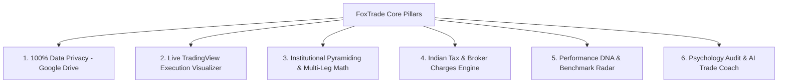
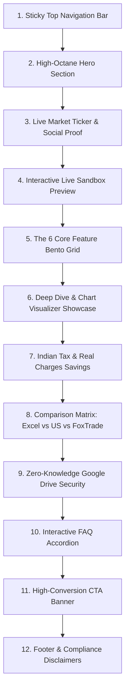

# 🦊 FoxTrade (`foxtrade.in`) — Complete Product & Landing Page Master Blueprint

> **Document Type:** Product Master Specification, Feature Inventory & Landing Page Blueprint  
> **Brand Name:** **FoxTrade** (formerly referenced as TradeOnTip / Nexus Pro)  
> **Web Domain:** `foxtrade.in`  
> **Target Audience:** Indian Equity (NSE / BSE), F&O (Futures & Options), Swing Traders, Intraday Scalpers, Breakout Investors, and Global Equity Traders  
> **Core Proposition:** Institutional-Grade Mathematical Discipline, Pinned Live TradingView Candlestick Execution Markers, Multi-Leg Pyramiding Engine, Native Indian STCG/LTCG Tax Engine, and 100% Zero-Knowledge Google Drive Privacy.

---

## 📑 Table of Contents

1. [Executive Summary & Core Mission](#1-executive-summary--core-mission)
2. [Target Audience & Trader Personas](#2-target-audience--trader-personas)
3. [The 6 Core Value Pillars (Why FoxTrade Wins)](#3-the-6-core-value-pillars-why-foxtrade-wins)
4. [Exhaustive Feature-by-Feature Inventory (All Modules)](#4-exhaustive-feature-by-feature-inventory-all-modules)
   - [Module 1: The Dynamic Journal Ledger](#module-1-the-dynamic-journal-ledger)
   - [Module 2: TradingView Candlestick Chart Engine & Execution Visualizer](#module-2-tradingview-candlestick-chart-engine--execution-visualizer)
   - [Module 3: Symbol Deep Dive Environment](#module-3-symbol-deep-dive-environment)
   - [Module 4: Performance DNA, Analytics & Benchmark Radar](#module-4-performance-dna-analytics--benchmark-radar)
   - [Module 5: Indian Tax (ITR) & Brokerage Charges Engine](#module-5-indian-tax-itr--brokerage-charges-engine)
   - [Module 6: Fund Management & Monthly Capital Matrix](#module-6-fund-management--monthly-capital-matrix)
   - [Module 7: Psychology, Mood Audit & AI Trade Coach](#module-7-psychology-mood-audit--ai-trade-coach)
   - [Module 8: Multi-Broker 1-Click CSV Ingestion](#module-8-multi-broker-1-click-csv-ingestion)
   - [Module 9: Multi-Portfolio Book Manager](#module-9-multi-portfolio-book-manager)
   - [Module 10: The Viral "Electricity Bill" Certificate](#module-10-the-viral-electricity-bill-certificate)
   - [Module 11: Derivatives & Expiry Tracker](#module-11-derivatives--expiry-tracker)
   - [Module 12: Corporate News Feed & Market Timers](#module-12-corporate-news-feed--market-timers)
5. [Complete Mathematical Specification & Formulas](#5-complete-mathematical-specification--formulas)
6. [Data Privacy Architecture (Google Drive Zero-Knowledge)](#6-data-privacy-architecture-google-drive-zero-knowledge)
7. [Landing Page Architecture & Section-by-Section Copy](#7-landing-page-architecture--section-by-section-copy)
   - [Section 1: Sticky Top Navigation Bar](#section-1-sticky-top-navigation-bar)
   - [Section 2: High-Octane Hero Section](#section-2-high-octane-hero-section)
   - [Section 3: Live Market Ticker & Institutional Proof Strip](#section-3-live-market-ticker--institutional-proof-strip)
   - [Section 4: Interactive Live Demo Sandbox Preview](#section-4-interactive-live-demo-sandbox-preview)
   - [Section 5: The 6 Core Feature Bento Grid](#section-5-the-6-core-feature-bento-grid)
   - [Section 6: Symbol Deep Dive & Execution Visualizer Showcase](#section-6-symbol-deep-dive--execution-visualizer-showcase)
   - [Section 7: Indian Tax & Real Charges Savings Breakdown](#section-7-indian-tax--real-charges-savings-breakdown)
   - [Section 8: Competitive Comparison Matrix (Excel vs US Journals vs FoxTrade)](#section-8-competitive-comparison-matrix)
   - [Section 9: Zero-Knowledge Google Drive Security Section](#section-9-zero-knowledge-google-drive-security-section)
   - [Section 10: High-Converting Interactive FAQ Accordion](#section-10-high-converting-interactive-faq-accordion)
   - [Section 11: Final Conversion CTA Banner](#section-11-final-conversion-cta-banner)
   - [Section 12: Professional Footer & SEBI Disclaimers](#section-12-professional-footer--sebi-disclaimers)
8. [Design System Tokens (Colors, Typography, UI Components)](#8-design-system-tokens)
9. [Next Steps: Connecting the Landing Page to the Live Tool](#9-next-steps-connecting-the-landing-page-to-the-live-tool)

---

## 1. Executive Summary & Core Mission

### The Problem in Trading Today
Over 90% of retail traders lose money—not because they lack chart patterns or trading ideas, but because of **poor risk management, emotional tilt, untracked leaks, and complex uncalculated charges**.
- **Excel & Google Sheets** break when formulas get complicated, require tedious manual entry, cannot display interactive candlestick charts, and do not track multi-leg pyramiding.
- **US/Global Web Journals** (like Tradervue, TraderSync, Edgewonk) charge \$30 to \$60/month (₹3,000–₹5,000/month), do not support Indian tax laws (STCG/LTCG, STT, Stamp Duty, GST), and store confidential trading books on insecure third-party servers.

### The FoxTrade Solution
**FoxTrade (`foxtrade.in`)** is an institutional-grade, zero-subscription trading journal engineered from the ground up for Indian retail and proprietary traders. It replaces guesswork and emotional bias with mathematical clarity.

Every trade entered dynamically drives:
1. **Interactive Candlestick Execution Markers** on sub-second TradingView charts.
2. **Institutional Mathematical Performance DNA** ($R$-multiples, Expectancy, Win Rate, Profit Factor, Open Heat).
3. **Symbol Deep Dive Deck** with before/after chart screenshots and psychology audits.
4. **Indian Tax & Brokerage Engine** computing net ITR capital gains (STCG @ 20%, LTCG @ 12.5%, STT, GST, Stamp Duty).
5. **100% Zero-Knowledge Privacy**, saving data directly to the trader's personal Google Drive.

---

## 2. Target Audience & Trader Personas

| Persona | Primary Needs & Pain Points | FoxTrade High-Impact Solution |
| :--- | :--- | :--- |
| **The Disciplined Swing Trader** | Holds stocks for 3–30 days. Needs multi-leg scale-in (P1–P4) and scale-out (E1–E4) calculations, Trailing Stop Losses (TSL), and holding-duration analytics. | Dynamic pyramiding ledger, weighted average prices, automated open heat % and risk-reward tracking. |
| **The F&O / Options Trader** | Executes multiple contracts per week. Bleeds money on hidden STT, brokerage, and exchange turnover charges. Needs expiry tracking. | Automated Indian charges estimator, Expiry Tracker page, and net take-home P&L calculations. |
| **The Systematic Breakout Trader** | Trades specific setups (e.g., IPO Base, VCP, Flat Base, 50 EMA Pullback). Needs to identify which setups yield positive expectancy. | Setup Matrix breakdown showing Win Rate, Profit Factor, and average $R$ per individual setup. |
| **The Privacy-Conscious Trader** | Reluctant to upload confidential tradebooks, capital sizes, and strategies to third-party databases. | 100% Zero-Knowledge architecture: Data stays on local device and trader's personal Google Drive. |
| **The Tax-Conscious Investor** | Struggling during tax season with quarterly advance tax and ITR-2 / ITR-3 capital gain schedules. | One-click export of STCG, LTCG, STT, and turnover schedules formatted for Indian CAs. |

---

## 3. The 6 Core Value Pillars (Why FoxTrade Wins)



1. **100% Zero-Knowledge Data Privacy (Google Drive First):**  
   FoxTrade has no central database holding user trades. All journal entries, notes, and metrics sync directly to a private JSON file in the user's Google Drive via scoped Google OAuth (`drive.file`).
2. **Live TradingView Execution Visualizer:**  
   Sub-second streaming candlestick charts with pinned execution badges: Emerald `Entry ⬆` placed beneath entry candles, and Crimson `Exit ⬇` placed above exit candles.
3. **Institutional Pyramiding & Scale-Out Math:**  
   Supports up to 4 scale-in legs (P1, P2, P3, P4) and 4 scale-out legs (E1, E2, E3, E4) with continuous volume-weighted price averaging, dynamic open quantity, and signed $R$-multiple math.
4. **Native Indian Tax & Charges Engine (ITR-Ready):**  
   Accurately applies post-2024 Union Budget tax rates (STCG @ 20%, LTCG @ 12.5% with ₹1.25 Lakh exemption), plus STT, SEBI turnover fees, State Stamp Duty, and 18% GST.
5. **Performance DNA & Benchmark Radar:**  
   Detailed statistical breakdown (Win Rate, Profit Factor, Expectancy, Max Drawdown) with live comparison against Indian benchmark indices (NIFTY 50, BANK NIFTY, NIFTY MIDSMALLCAP 400).
6. **Psychology Tiltmeter & AI Trade Coach:**  
   Tracks mood, FOMO, panic exits, rule violations, and discipline compliance to eliminate emotional leaks and revenge trading.

---

## 4. Exhaustive Feature-by-Feature Inventory (All Modules)

### Module 1: The Dynamic Journal Ledger
The command center of FoxTrade. A high-density, real-time trading table that combines spreadsheet flexibility with algorithmic intelligence.
- **Inline Cell Editing:** Edit symbol, dates, setups, buy/sell, price, quantity, stop-loss, and exit details directly inside table cells with instant recalculation.
- **40+ Configurable Columns:** Toggle any column on/off using the Column Visibility Popover.
- **Pyramiding Expanders (`+` Header Icon):** Click `+` on the header to reveal legs P1 $\rightarrow$ P2 $\rightarrow$ P3 $\rightarrow$ P4 on demand.
- **Scaling-Out Expanders:** Reveal partial exits E1 $\rightarrow$ E2 $\rightarrow$ E3 $\rightarrow$ E4 on demand.
- **Smart Hover Summary Card:** Hovering over the Deep Dive arrow (`↗`) next to any stock displays a floating card showing entry, SL, R:R, CMP, P&L, and chart thumbnail with auto-flip viewport detection.
- **Search & Multi-Dimensional Filtering:** Instant search by ticker or setup; filter by status (`All`, `Active`, `Open`, `Partial`, `Closed`), outcome (`Wins`, `Losses`, `Breakeven`), or date ranges (`Today`, `This Month`, `FY25-26`, `Custom`).
- **Pagination Controls:** Instant pagination supporting 10, 12, 25, 50, or 100 rows per page.
- **Eye Toggle (Privacy Mode):** One-click button to blur/hide all monetary ₹ amounts when trading in public spaces or taking screenshots.

---

### Module 2: TradingView Candlestick Chart Engine & Execution Visualizer
A high-performance charting suite embedded directly into the journal.
- **Lightweight Charts v5.2 Core:** Smooth 60fps candlestick rendering with support for Candlestick, Line, Area, and Bar modes.
- **Pinned Execution Markers:** Automatically places vivid Emerald `Entry ⬆` badges below the entry candle and Deep Crimson `Exit ⬇` markers above exit candles.
- **Multi-Timeframe Selection:** `1mo`, `3mo`, `6mo`, `1y`, `2y`, `5y`, `Max`, and custom date ranges.
- **Technical Overlays:** Configurable moving averages:
  - 20 SMA / EMA (Short-term momentum)
  - 50 SMA / EMA (Institutional trend guide)
  - 200 SMA / EMA (Long-term structural baseline)
- **Bar-by-Bar Replay Simulator:** Practice trading past market setups candle-by-candle with Play, Pause, Step Forward, and $1\times, 2\times, 5\times$ speed control.
- **Drawing Tools Suite:** Interactive trendlines, horizontal support/resistance levels, ruler/measuring tool (percentage and bar count), and stop/target risk brackets.
- **Chart Snapshot & Export:** One-click export to high-resolution PNG or printable PDF complete with the FoxTrade watermark.
- **Top Performers Filter:** Rank trades by top winners, top losers, or filter by minimum gain threshold (e.g., moves $> 5\%$, $> 10\%$).

---

### Module 3: Symbol Deep Dive Environment (`/symbol/:symbol/trade/:tradeNo`)
A dedicated per-stock investigation deck designed for post-trade reviews.
- **Header Navigation:** Quick toggle between `‹ Previous Trade` and `› Next Trade` for that symbol, or search with symbol autocomplete.
- **Split-Screen Workspace:**
  - **Left Side:** Rich-text Trade Note Editor with title (max 80 chars), multi-tag manager (`0/8` tags), 5-level emotional mood selector (`😀`, `🙂`, `😐`, `🙁`, `😡`), one-click text export, and voice dictation.
  - **Right Side:** Execution Evidence Gallery with side-by-side `Before Entry` and `After Exit` chart image uploads, TradingView snapshot URL previews, and full-screen lightbox viewing.

---

### Module 4: Performance DNA, Analytics & Benchmark Radar
Transforms raw trade logs into institutional performance intelligence.
- **Primary KPIs:**
  - **Win Rate %:** Percentage of closed trades ending in profit.
  - **Profit Factor:** Gross Profit $\div$ Gross Loss.
  - **Expectancy ($R$):** Average return per unit of risk taken.
  - **Win/Loss Ratio:** Average Win amount vs Average Loss amount.
  - **Max Drawdown %:** Peak-to-trough equity decline.
  - **Open Heat %:** Total capital currently at risk based on active stop losses.
- **Benchmark Comparison Radar:** Overlay your cumulative equity curve against Indian benchmark indices:
  - NIFTY 50
  - BANK NIFTY
  - NIFTY MIDSMALLCAP 400
  - NIFTY SMALLCAP 100
  - NIFTY 500
- **Setup Efficiency Matrix:** Win rate and profit factor grouped by trading setup (Breakout vs Pullback vs IPO Base vs Reversal).
- **Holding Period Distribution:** Visual distribution of holding days (Intraday, 1–3 days, 1–2 weeks, 1+ months) vs profitability.
- **Streak Tracker:** Active winning/losing streaks and historical maximum streak records.

---

### Module 5: Indian Tax (ITR) & Brokerage Charges Engine
Built strictly for Indian compliance rules—no manual spreadsheet adjustments needed.
- **Short-Term Capital Gains (STCG):** Calculates tax on equity held $< 12$ months at the official 20% rate.
- **Long-Term Capital Gains (LTCG):** Calculates tax on equity held $\ge 12$ months at 12.5%, factoring in the ₹1.25 Lakh annual exemption limit.
- **Transaction Charges Breakdown:**
  - **STT (Securities Transaction Tax):** 0.1% on delivery Buy & Sell legs.
  - **Exchange Turnover Fees & SEBI Charges:** Automatic rate application.
  - **State Stamp Duty:** 0.015% on buy legs.
  - **GST:** 18% applied across brokerage and exchange turnover fees.
- **Broker Presets:** Pre-configured rate models for Zerodha, Angel One, Groww, Dhan, and Upstox.
- **ITR-Ready Export:** Download detailed tax schedules in Excel (`.xlsx`), CSV, or PDF to share with your Chartered Accountant.

---

### Module 6: Fund Management & Monthly Capital Matrix
Institutional-grade capital allocation and monthly ledger tracking.
- **Month-by-Month Capital Progression:**
  - Starting Capital, Capital Additions (pay-ins), Capital Withdrawals (pay-outs), Net P/L, Monthly Return %, Ending Capital, Trade Count, Win %, and Average $R$.
- **CAGR Tracking:** Cumulative and annualized growth rate calculation over time.
- **Inline Editing of Capital Changes:** Easily record deposits or withdrawals directly in monthly cells with custom notes.
- **Cash Buffer vs Invested Gauge:** Visual meter showing active exposure vs idle cash.

---

### Module 7: Psychology, Mood Audit & AI Trade Coach
Designed to pinpoint and fix emotional leaks in trading execution.
- **5-Tier Emotional Mood Log:** Traders record emotional state upon entering/exiting (`😀 Great`, `🙂 Good`, `😐 Neutral`, `🙁 Frustrated`, `😡 Terrible`).
- **Plan Compliance Audit:** Explicit `Plan Followed: Yes / No / Partial` field to separate good executions with bad outcomes from bad executions with lucky outcomes.
- **Exit Trigger Classification:** Tag exit rationale (`Target Hit`, `Stop Loss Hit`, `Trailing SL Hit`, `End of Day`, `Panic / Emotion`, `Rule Violation`).
- **Tiltmeter & AI Coach:** Analyzes trade frequency and sizing spikes following losses to detect revenge trading, overleveraging, and tilt risk.

---

### Module 8: Multi-Broker 1-Click CSV Ingestion
Eliminates manual data entry by importing trade logs directly from popular Indian brokers.
- **Supported Brokers:** Zerodha Kite, Groww, Angel One, Dhan, Upstox, and Nexus Journal CSVs.
- **Deduplication Engine:** Automatically detects and prevents duplicate trade records during re-imports.
- **Instant Mapping:** Auto-maps broker order books into multi-leg buy and sell legs.

---

### Module 9: Multi-Portfolio Book Manager
Manage multiple segregated trading accounts without switching tools.
- **Isolated Trading Books:** Keep Swing Trading, Intraday F&O, Long-Term Investments, and Prop Desk funds completely separate.
- **Independent Capital Bases:** Each portfolio tracks its own starting capital, deposits, withdrawals, equity curve, and tax liabilities.
- **One-Click Switcher:** Fast portfolio dropdown located in the top navigation bar.

---

### Module 10: The Viral "Electricity Bill" Certificate
A viral community feature loved by Indian retail traders.
- **The Milestone Concept:** An interactive certificate that answers the popular trading milestone: *"Did my trading pay my electricity bill this month?"*
- **Statement Generator:** Generates a verified monthly certificate showing gross profit, broker charges, net take-home earnings, and whether your profits covered household overheads.
- **Shareable & Printable:** One-click print or social media export for Twitter/X, Instagram, and LinkedIn.

---

### Module 11: Derivatives & Expiry Tracker
- **Weekly & Monthly Expiry Countdown:** Real-time countdown to NIFTY, BANKNIFTY, and FINNIFTY derivative expirations.
- **F&O Contract Tagging:** Track Call Options (`CE`), Put Options (`PE`), and Futures contracts alongside equity delivery trades.

---

### Module 12: Corporate News Feed & Market Timers
- **Live IST Market Status:** Real-time badge indicating whether NSE/BSE markets are open, in pre-market, or closed.
- **Market Countdown Clock:** Dynamic countdown ticking down to market open (09:15 IST) or market close (15:30 IST).
- **Corporate Filings Feed:** Embedded stream of company announcements, dividend declarations, quarterly earnings, and board meetings.
- **3 Color Theme Modes:**
  - **Light Mode:** Crisp, clean white journal workspace.
  - **Dark Slate Mode:** Low-light midnight styling.
  - **Pitch-Black Mode:** True pure-black contrast designed for OLED displays.

---

## 5. Complete Mathematical Specification & Formulas

All metrics in FoxTrade follow institutional accounting standards:

### 1. Weighted Average Entry Price ($\text{Avg Entry}$)
Accounts for the initial trade plus all scale-in pyramid additions (P1 through P4):
$$\text{Avg Entry} = \frac{(\text{Qty} \times \text{Entry}) + \sum_{i=1}^{4} (P_{i,\text{Qty}} \times P_{i,\text{Price}})}{\text{Qty} + \sum_{i=1}^{4} P_{i,\text{Qty}}}$$

### 2. Weighted Average Exit Price ($\text{Avg Exit}$)
Accounts for all scale-out partial exits (E1 through E4):
$$\text{Avg Exit} = \frac{\sum_{i=1}^{4} (E_{i,\text{Qty}} \times E_{i,\text{Price}})}{\sum_{i=1}^{4} E_{i,\text{Qty}}}$$

### 3. Total Quantities & Open Position Status
$$\text{Total Entered} = \text{Qty} + \sum_{i=1}^{4} P_{i,\text{Qty}}, \quad \text{Total Exited} = \sum_{i=1}^{4} E_{i,\text{Qty}}$$
$$\text{Open Qty} = \max(0, \text{Total Entered} - \text{Total Exited})$$
$$\text{Status} = \begin{cases} \text{"Closed"}, & \text{if } \text{Open Qty} = 0 \text{ and } \text{Total Entered} > 0 \\ \text{"Partial"}, & \text{if } \text{Total Exited} > 0 \text{ and } \text{Open Qty} > 0 \\ \text{"Open"}, & \text{if } \text{Total Exited} = 0 \text{ and } \text{Open Qty} > 0 \end{cases}$$

### 4. Realized, Unrealized & Gross P&L (₹)
- **Realized P&L (Buy):** $(\text{Avg Exit} - \text{Avg Entry}) \times \text{Total Exited}$
- **Unrealized P&L (Buy):** $(\text{CMP} - \text{Avg Entry}) \times \text{Open Qty}$
- **Gross P&L:** $\text{Realized P&L} + \text{Unrealized P&L}$

### 5. Risk-to-Reward Ratio ($R$-Multiple)
$$\text{Risk Per Share} = |\text{Avg Entry} - \text{Initial SL}|$$
$$\text{Reward Per Share} = \begin{cases} \text{Avg Exit} - \text{Avg Entry}, & \text{if position is closed} \\ \text{CMP} - \text{Avg Entry}, & \text{if position is open} \end{cases}$$
$$R = \frac{\text{Reward Per Share}}{\text{Risk Per Share}}$$

### 6. Capital at Risk & Open Heat %
$$\text{Effective SL} = \max(\text{Initial SL}, \text{TSL})$$
$$\text{Capital at Risk (₹)} = \max(0, (\text{Avg Entry} - \text{Effective SL}) \times \text{Open Qty})$$
$$\text{Open Heat (\%)} = \frac{\text{Capital at Risk (₹)}}{\text{Portfolio Capital}} \times 100$$

### 7. Portfolio Impact % & Expectancy
$$\text{Portfolio Impact (\%)} = \frac{\text{Gross P&L}}{\text{Portfolio Base Capital}} \times 100$$
$$\text{Expectancy} = (\text{Win Rate} \times \text{Avg Win}) - (\text{Loss Rate} \times \text{Avg Loss})$$

---

## 6. Data Privacy Architecture (Google Drive Zero-Knowledge)

```
┌─────────────────────────────────────────────────────────┐
│                       User Device                       │
│     (FoxTrade Browser App · React · IndexedDB Cache)    │
└───────────────────────────┬─────────────────────────────┘
                            │
               Direct Encrypted HTTPS Sync
               (Google OAuth drive.file Scope)
                            │
                            ▼
┌─────────────────────────────────────────────────────────┐
│               User's Personal Google Drive              │
│         File: Google Drive / foxtrade_journal.json      │
│                                                         │
│     • 100% Owned by the Trader                          │
│     • Zero Central Database Storage                     │
│     • Inaccessible by FoxTrade Servers or 3rd Parties   │
└─────────────────────────────────────────────────────────┘
```

- **Scoped OAuth Access:** FoxTrade only requests `https://www.googleapis.com/auth/drive.file`. This restricted scope only allows FoxTrade to read and write files that it created itself (`foxtrade_journal.json`). It **cannot** view or access any other files in the user's Google Drive.
- **Offline First:** All trades are cached locally. If the user loses internet connection during a trading session, changes persist and sync automatically once reconnected.
- **No Lock-in:** Traders can download their raw journal file or export clean CSV files at any time.

---

## 7. Landing Page Architecture & Section-by-Section Copy

Use the detailed sections below to build the landing page for **FoxTrade (`foxtrade.in`)**:



---

### Section 1: Sticky Top Navigation Bar
- **Left Brand Mark:** FoxTrade logo emblem (Vivid Orange fox mark) + **FoxTrade** typography in bold Inter + small pill `foxtrade.in`.
- **Center Market Status Pill:** Dynamic real-time pill: `● NSE Live` (Emerald) or `○ NSE Closed` (Slate) with IST market countdown timer.
- **Center Navigation Links:**
  - `Features` (Scrolls to Bento Grid)
  - `Live Charts` (Scrolls to TradingView visualizer section)
  - `Tax & Brokerage` (Scrolls to Tax Engine)
  - `Privacy` (Scrolls to Google Drive Zero-Knowledge section)
  - `FAQ` (Scrolls to FAQs)
- **Right Action Buttons:**
  - **`⚡ Explore Live Demo`** (Secondary ghost button with emerald border: triggers instant demo sandbox without login).
  - **`Sign In / Join Free`** (Primary high-contrast dark button: triggers Google OAuth popup).

---

### Section 2: High-Octane Hero Section
- **Top Badge Pill:**  
  `🇮🇳 Built for Indian Traders · NSE / BSE / F&O · 100% Google Drive Privacy`
- **Main Headline (H1):**  
  **Stop Trading on Emotion.**  
  <span style="color:#f97316">**Master Your Trading DNA.**</span>
- **Supporting Sub-Headline:**  
  *The institutional trading journal, live TradingView execution visualizer, and risk management suite built specifically for Indian traders. Track every setup, eliminate every leak, and calculate net ITR capital gains—with 100% data privacy on your personal Google Drive.*
- **Dual Conversion CTAs:**
  1. **Primary Button:** `Continue with Google` (with official Google 'G' logo icon).  
     *Micro-copy beneath:* "Zero password setup · Connects directly to your Google Drive · 100% Free Forever"
  2. **Secondary Button:** `⚡ Explore Live Sandbox Demo`  
     *Micro-copy beneath:* "Try all 40+ columns, TradingView charts & tax analytics instantly with pre-loaded mock trades"
- **Floating Live Metric Badges (Visual Accents):**
  - 📈 `Win Rate: 68.4%` (Emerald badge)
  - 🎯 `Profit Factor: 2.85` (Indigo badge)
  - 🛡️ `Max Open Heat: 1.2%` (Cyan badge)
  - 🔒 `Zero-Knowledge Google Drive Sync` (Amber badge)

---

### Section 3: Live Market Ticker & Institutional Proof Strip
- **Real-Time Index Bar:** Live price pills for `NIFTY 50`, `BANKNIFTY`, `SENSEX`, `INDIA VIX`.
- **4 Key Proof Badges:**
  - **2,369+** NSE & BSE Equities with Auto-Suggest
  - **Sub-Second** Live TradingView WebSocket Charts
  - **6 Major Brokers** Supported via 1-Click CSV Import
  - **₹0 Cost** (No subscriptions, no feature paywalls)

---

### Section 4: Interactive Live Demo Sandbox Preview
An embedded interactive UI mockup showcasing the actual FoxTrade platform:
- Tab selector allowing visitors to preview:
  - `Journal Ledger` (Interactive table with inline edit indicators and expander buttons)
  - `TradingView Chart` (Candlestick chart with pinned `Entry ⬆` and `Exit ⬇` markers)
  - `Symbol Deep Dive` (Before & After screenshot gallery with trade notes)
  - `Tax Analytics` (STCG, LTCG, and STT fee breakdowns)

---

### Section 5: The 6 Core Feature Bento Grid
A high-impact 6-card bento grid highlighting FoxTrade's primary capabilities:

| Card Title | Headline & Copy | Visual / UI Feature |
| :--- | :--- | :--- |
| **1. Dynamic Journal Ledger** | **Spreadsheet Speed. Algorithmic Intelligence.**<br>Edit inline like Excel, but with automated weighted average prices, 40+ columns, and multi-leg scale-in (P1–P4) & scale-out (E1–E4) tracking. | Table snippet with color-coded P&L and pyramid expander icons. |
| **2. Live TradingView Charts** | **See Exactly Where You Entered & Exited.**<br>Sub-second streaming candles with automated execution badges pinned directly to your entry and exit bars. Multi-timeframes with moving averages. | Candlestick visual with emerald `Entry ⬆` and crimson `Exit ⬇` badges. |
| **3. Symbol Deep Dive** | **Every Ticker Tells a Story.**<br>Post-trade inspection deck with side-by-side Before/After chart galleries, rich-text thesis logging, and voice dictation notes. | Split card showing chart screenshots + rich-text trade note. |
| **4. Performance DNA** | **Know Your Edge Down to the Decimal.**<br>Stop guessing which setups work. Track Win Rate, Profit Factor, Expectancy, and benchmark your equity curve against NIFTY 50. | Benchmark curve comparing Trader vs NIFTY 50. |
| **5. Indian Tax & Broker Charges** | **Zero Tax Season Surprises.**<br>Automated calculation of updated Union Budget capital gains (STCG @ 20%, LTCG @ 12.5%), STT, SEBI fees, stamp duty, and GST. Export directly for your CA. | ITR summary card with net tax liability and turnover. |
| **6. Psychology & Tiltmeter** | **Catch Emotional Tilt Before It Ruins Your Capital.**<br>Track mood, discipline compliance, and rule violations. Receive automated alerts when overtrading or revenge trading patterns appear. | Tilt gauge with mood selectors (`😀`, `🙂`, `😐`, `🙁`, `😡`). |

---

### Section 6: Symbol Deep Dive & Execution Visualizer Showcase
- **Headline:** *"Review Like an Institutional Fund Manager."*
- **Sub-Headline:** *"Winning traders don't just count profits—they audit their executions. Inspect every candle, examine your psychological state, and preserve chart evidence for every setup."*
- **3 Visual Feature Callouts:**
  - **Visual Before/After Gallery:** Drag and drop chart snapshots or paste TradingView share links to maintain visual trade documentation.
  - **Bar-by-Bar Replay Mode:** Replay market price action candle-by-candle to analyze whether you followed your trading rules or exited prematurely.
  - **Discipline & Mood Audit:** Tag trade mood and mark whether your trading plan was followed (`Yes`, `No`, `Partial`) to separate good process from luck.

---

### Section 7: Indian Tax & Real Charges Savings Breakdown
- **Headline:** *"Built for Indian Taxes. Not Wall Street."*
- **Sub-Headline:** *"Generic American journals calculate US short-term gains and ignore Indian market realities. FoxTrade applies updated Indian Finance Act tax rules and domestic transaction charges automatically."*
- **Comparison Table of Charges:**
  - Short-Term Capital Gains: 20% on equity held $< 12$ months.
  - Long-Term Capital Gains: 12.5% on equity held $\ge 12$ months (with ₹1.25 Lakh exemption).
  - Securities Transaction Tax (STT): 0.1% on delivery Buy & Sell.
  - State Stamp Duty: 0.015% on buy turnover.
  - Exchange Turnover & SEBI Charges: Applied per contract segment.
  - GST: 18% on brokerage & transaction levies.
- **ITR Export Callout:** Download Excel/PDF schedules ready for ITR-2 or ITR-3 tax filing.

---

### Section 8: Competitive Comparison Matrix

| Feature / Capability | Excel / Google Sheets | US Web Journals (Tradervue, etc.) | **FoxTrade (`foxtrade.in`)** |
| :--- | :---: | :---: | :---: |
| **Data Privacy** | Manual local files | Stored on 3rd-party US servers | **100% Google Drive (Zero-Knowledge)** |
| **Live TradingView WebSocket Charts** | ❌ None | Static screenshots only | **✅ Live WebSocket Streaming + Replay** |
| **Pinned Entry & Exit Badges** | ❌ Manual drawing | ❌ None | **✅ Automatic Entry & Exit Badges** |
| **Pyramiding (P1–P4) & Partial Exits (E1–E4)** | ⚠️ Broken complex formulas | ❌ Single-leg entry only | **✅ Multi-Leg Weighted Institutional Math** |
| **Indian Tax (STCG 20%, LTCG 12.5%)** | ❌ Not available | ❌ US taxes only | **✅ Built-in Indian Finance Act Rules** |
| **Indian Broker Charges (STT, GST, Stamp)** | ❌ Not available | ❌ Not supported | **✅ Native Zerodha, Groww, Dhan, Angel One** |
| **Multi-Broker CSV Ingestion** | ❌ Manual copy-paste | ⚠️ Paid add-on | **✅ 1-Click Free Drag & Drop** |
| **Psychology Mood & Tilt Tracking** | ❌ None | ⚠️ Basic text notes | **✅ 5-Level Mood Audit + Tilt Alerts** |
| **Monthly Subscription Cost** | ₹0 (High effort) | \$30–\$60/mo (₹3,000–₹5,000/mo) | **₹0 Free Forever** |

---

### Section 9: Zero-Knowledge Google Drive Security Section
- **Headline:** *"Your Trades Are Nobody Else's Business."*
- **Sub-Headline:** *"Your tradebook contains your edge, your sizing, and your financial data. FoxTrade is engineered with zero-knowledge architecture—we never store your trading records on our servers."*
- **The 3 Privacy Guarantees:**
  1. **Direct Google Drive Sync:** Your data lives in a private file (`foxtrade_journal.json`) inside your personal Google Drive.
  2. **Scoped Permissions:** FoxTrade only requests `drive.file` access—meaning it cannot view or touch any other files in your Google account.
  3. **Local Offline Reliability:** Fast local browser caching ensures uninterrupted journaling even during internet dropouts.

---

### Section 10: High-Converting Interactive FAQ Accordion

1. **Is FoxTrade genuinely 100% free? Are there hidden paywalls?**  
   *Yes, FoxTrade is completely free. All features—including live TradingView charts, multi-leg pyramiding, Indian tax calculations, and multi-broker imports—are unlocked for every user without subscriptions.*
2. **Where is my trading data stored? Can FoxTrade see my trades?**  
   *No. FoxTrade uses zero-knowledge architecture. Your trades are stored directly in your personal Google Drive and cached locally on your device. We do not store your trade history on central servers.*
3. **Does FoxTrade support Options, Futures, and Commodities?**  
   *Yes. FoxTrade supports NSE/BSE Cash Equities, Stock & Index Futures, Call/Put Options, and MCX Commodities, complete with derivative expiry tracking.*
4. **How do I import trades from my broker?**  
   *Export your tradebook CSV from Zerodha Kite, Groww, Angel One, Dhan, or Upstox, and drop it into our 1-click importer. FoxTrade automatically parses and categorizes your trades.*
5. **How does the multi-leg pyramiding calculation work?**  
   *If you add to a winning trade (P1 to P4) or scale out in parts (E1 to E4), FoxTrade continuously computes the volume-weighted average entry and exit prices, adjusting your open heat and risk-reward ratio dynamically.*
6. **Can I use FoxTrade on mobile or tablet?**  
   *Yes. FoxTrade features a responsive layout optimized for desktop, tablet, and mobile browsers.*
7. **What is the "Electricity Bill" milestone?**  
   *It is an interactive community feature that generates a verified certificate showing whether your net trading profits for the month covered your household electricity bill and living expenses.*

---

### Section 11: Final Conversion CTA Banner
- **Headline:** *"Ready to Trade with Mathematical Discipline?"*
- **Sub-Headline:** *"Join thousands of Indian retail and prop traders who log, review, and sharpen their edge with FoxTrade every market day."*
- **Action Buttons:**
  - `Continue with Google` (One-tap instant setup)
  - `⚡ Explore Live Sandbox Demo` (Zero signup required)
- **Trust Reassurance:**  
  *No credit card · No password required · 100% Private to your Google Drive*

---

### Section 12: Professional Footer & SEBI Disclaimers
- **Left Column:** FoxTrade Logo, tagline (*"The Trading Journal Built for Mathematical Discipline"*), and domain `foxtrade.in`.
- **Center Links:** Features, Live Charts, Tax Analytics, Fund Management, Privacy Architecture, Terms of Service, Privacy Policy.
- **Right Column:** Community Links (Twitter/X, Telegram, YouTube).
- **Mandatory Regulatory Disclaimer:**  
  *Disclaimer: FoxTrade (`foxtrade.in`) is an educational and analytical trade journaling platform designed to assist traders in tracking and reviewing their trading performance. FoxTrade is not a SEBI-registered investment advisor or broker, and does not provide buy/sell stock recommendations or financial advice. Securities trading involves substantial risk of loss. Past performance tracked on FoxTrade does not guarantee future results.*

---

## 8. Design System Tokens

### Color Tokens
- **Background Primary:** `#0B0F17` (Deep Obsidian / Midnight Dark) or `#F8F9FA` (Clean Light)
- **Surface / Card Background:** `#111827` (Dark Slate) / `#FFFFFF` (Card Light)
- **Border Stroke:** `#1E293B` (Dark Border) / `#E5E7EB` (Light Border)
- **Brand Accent (Fox Orange):** `#F97316` (Primary Fox Accent) / `#EA580C` (Hover State)
- **Profit / Win Emerald:** `#10B981` (Vivid Emerald Green)
- **Loss / Risk Crimson:** `#EF4444` (High-Contrast Red)
- **Text Primary:** `#F9FAFB` (Dark mode 900 White) / `#111827` (Light mode 900 Black)
- **Text Muted:** `#9CA3AF` (Gray 400) / `#6B7280` (Gray 500)

### Typography
- **Primary Font Family:** `'Inter', -apple-system, BlinkMacSystemFont, 'Segoe UI', Roboto, sans-serif`
- **Monospace (Numbers & Financials):** `'JetBrains Mono', 'Fira Code', monospace`

---

## 9. Next Steps: Connecting the Landing Page to the Live Tool

When the landing page is published or attached to the application, here is the direct integration flow:

```
┌────────────────────────────────────────────────────────┐
│             Landing Page (foxtrade.in)                 │
│                                                        │
│  [⚡ Explore Live Demo]       [Continue with Google]   │
└───────────────┬───────────────────────────┬────────────┘
                │                           │
                ▼                           ▼
┌───────────────────────────────┐   ┌───────────────────────────┐
│     Demo Sandbox Session      │   │   Firebase Google OAuth   │
│  (Loads mock Indian trades:   │   │  (Requests drive.file     │
│   RELIANCE, TATASTEEL, NIFTY) │   │   scope for Google Drive) │
└───────────────┬───────────────┘   └───────────┬───────────────┘
                │                               │
                └───────────────┬───────────────┘
                                ▼
┌────────────────────────────────────────────────────────┐
│            Full FoxTrade Journal Dashboard             │
│        (Journal, Charts, Tax, Analytics, Notes)        │
└────────────────────────────────────────────────────────┘
```

1. **Live Demo Button (`⚡ Explore Live Demo`):**  
   Sets a guest trader profile (`demo-trader-1`) and immediately mounts `Dashboard.jsx` with pre-loaded mock Indian equities and setups so visitors can experience the full platform with zero friction.
2. **Google OAuth Button (`Continue with Google`):**  
   Calls `loginWithGoogle()` via Firebase Authentication, captures user profile and Google Drive access token, loads existing `foxtrade_journal.json` from Drive, and opens the user's private journal.
3. **Session Persistence:**  
   User tokens and local cache are preserved in `localStorage`, so returning visitors bypass the landing page and immediately open their active journal.

---
*Created for FoxTrade (`foxtrade.in`) — Version 2.0.0 Pro Master Specification.*
