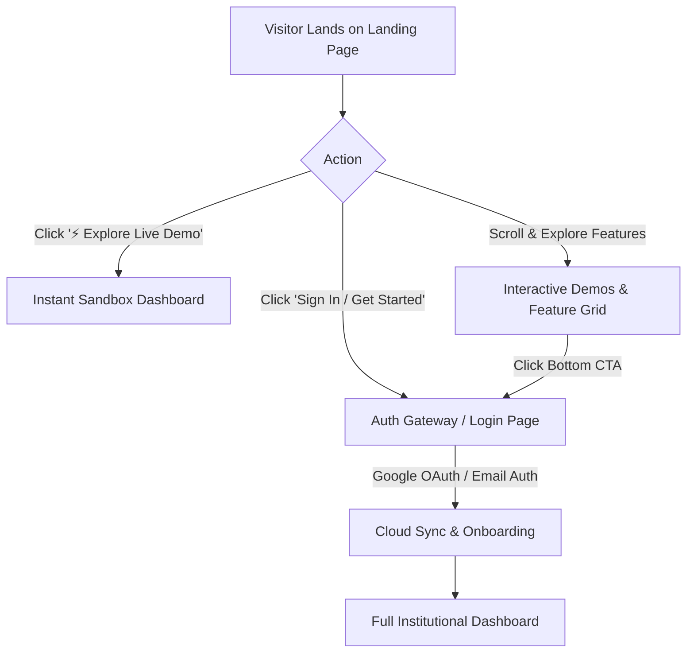
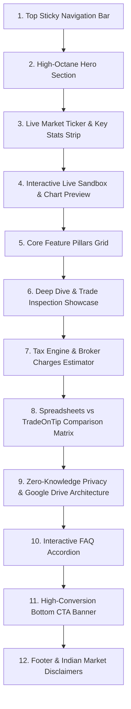
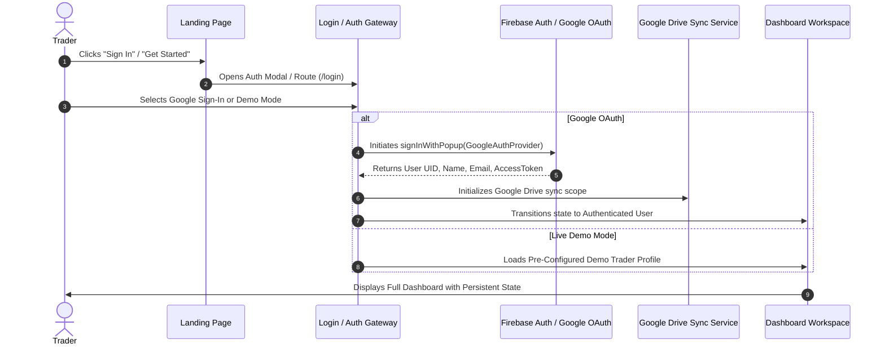
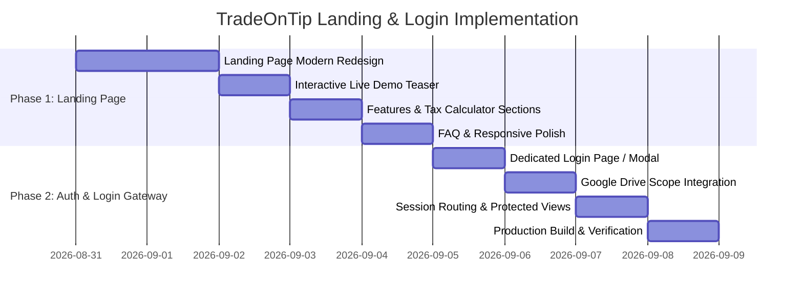

# 🚀 TradeOnTip — Landing Page & Login Integration Blueprint

> **Document Version:** 1.0.0 Pro  
> **Target Audience:** Indian Equity (NSE/BSE), F&O, Swing & Intraday Traders  
> **Core Proposition:** Institutional-Grade Trading Journal, Live TradingView WebSocket Charts, Mathematical Performance DNA, and Zero-Knowledge Google Drive Privacy.

---

## 📌 Executive Overview

This specification outlines the architecture, visual design system, feature storytelling, and user conversion funnel for the **TradeOnTip Landing Page**, followed by the seamless attachment of the **Authentication / Login Page & Gateway**.



---

## 🌟 1. Landing Page Value Proposition & Messaging

### 🎯 Primary Hook
> **"Stop Trading on Emotion. Master Your Trading DNA."**  
> *The all-in-one institutional journal, live TradingView execution charts, and risk-management suite built specifically for Indian traders.*

### 🔑 The 4 Pillars of Value
1. **100% Data Privacy (Google Drive First):** Trade records never reside on insecure third-party servers. Your journal is synced directly to your personal Google Drive and cached locally for offline speed.
2. **Execution Visualizer on Live Charts:** Pinned entry/exit badges on real-time TradingView WebSocket candlestick feeds across multi-timeframes (`5m`, `15m`, `1h`, `1D`).
3. **Institutional Mathematics:** Automatic calculation of $R$-Multiples, Expectancy, Win Rate, Profit Factor, Open Heat, and Pyramiding legs (P1–P4) vs Scaling exits (E1–E4).
4. **Indian Market Native (INR & Tax):** Pre-built STCG/LTCG tax calculators, STT, Exchange turnover fees, Stamp Duty, GST, and 1-click multi-broker CSV imports (Zerodha, Groww, Angel One, Dhan, Upstox).

---

## 📐 2. Landing Page Layout & Section Breakdown



---

### Section 1: Modern Sticky Header / Navigation
* **Brand Logo & Name:** TradeOnTip icon with vivid emerald/orange gradient mark.
* **Live Market Status Indicator:** Real-time badge showing `● NSE Live / Closed` based on Indian Standard Time (09:15 – 15:30 IST).
* **Navigation Links:**
  * `Features` (Smooth scroll to feature grid)
  * `Charts & Deep Dive` (Jump to chart engine preview)
  * `Tax & Brokerage` (Jump to tax section)
  * `Privacy` (Jump to Google Drive zero-knowledge architecture)
  * `FAQ`
* **Header Actions:**
  * **`⚡ Live Demo`** pill button (Opens instant read/write demo sandbox)
  * **`Sign In / Join Free`** primary button (Opens Auth Modal / navigates to Login)

---

### Section 2: High-Octane Hero Section
* **Badge Pill:** `🇮🇳 Built for Indian Traders · NSE / BSE / F&O · Zero Server Storage`
* **Main Headline:**
  * **The Trading Journal Built for Mathematical Discipline.**
  * *Accentuated in glowing gradient text: "Track Every Edge. Eliminate Every Leak."*
* **Subheadline:**
  * *"Log trades in seconds, inspect execution markers on live TradingView charts, analyze your psychology tilt, and calculate net ITR capital gains. 100% private to your Google Drive."*
* **Dual Primary CTAs:**
  1. **`Continue with Google`** (One-tap Google OAuth popup with instant sync)
  2. **`⚡ Explore Live Demo`** (Zero-friction interactive sandbox with pre-loaded mock trades)
* **Floating Micro-Metrics Badges (Live Motion):**
  * `📈 Win Rate: 68.4%` (Emerald badge)
  * `🎯 Profit Factor: 2.85` (Indigo badge)
  * `🛡️ Max Open Heat: 1.2%` (Cyan badge)
  * `🔒 100% Zero-Knowledge Storage` (Amber badge)

---

### Section 3: Live Market Ticker & Institutional Stats Strip
* **Market Live Bar:** Real-time price pills for `NIFTY 50`, `BANKNIFTY`, `SENSEX`, `INDIA VIX`.
* **Social Proof Counter Strip:**
  * **2,369+** NSE & BSE Equities Supported
  * **Sub-Second** Live TradingView WebSocket Feed
  * **6+ Major Brokers** CSV Ingestion (Zerodha, Angel One, Groww, Dhan, Upstox)
  * **₹0 Platform Cost** (100% Free & Open Ecosystem)

---

### Section 4: Interactive Live Sandbox & Chart Preview
* **Interactive UI Mockup:** An embedded, responsive interactive preview of the TradeOnTip workspace:
  * **Top Toolbar:** Switch between `Journal Ledger`, `Stock Charts`, `Symbol Deep Dive`, and `Analytics`.
  * **Interactive Candlestick Chart:** Interactive canvas with clickable `Buy ⬆` and `Exit ⬇` markers.
  * **Live Trade Note Editor:** Showing psychology mood tags (`😀 Disciplined`, `😐 FOMO prevented`) and rich-text execution thesis.

---

### Section 5: Core Feature Pillars Grid (6 High-Impact Cards)

| Feature Pillar | Key Capability | Visual Highlight |
| :--- | :--- | :--- |
| **1. Dynamic Journal Ledger** | Inline cell editing, 40+ dynamic columns, multi-leg Pyramiding (P1–P4) & Exits (E1–E4), and auto-calculated $R$-multiples. | Spreadsheet grid with color-coded P&L and quick-edit drawers. |
| **2. Live TradingView WebSocket Charts** | Sub-second streaming candle data with 3-tier fallback (TradingView WS $\rightarrow$ Yahoo Finance $\rightarrow$ Synthetic). Multi-timeframes (`5m` to `1M`). | Real-time chart with glowing `● TradingView Live` badge. |
| **3. Symbol Deep Dive Environment** | Dedicated per-stock inspection deck with pinned execution markers, image galleries (`Before Entry` / `After Exit`), and audio voice notes. | Split-screen chart + notes workspace for any chosen stock. |
| **4. Performance DNA & Heatmaps** | Win Rate %, Profit Factor, Expectancy, Setup Efficiency breakdown (Breakouts vs Pullbacks), and Calendar P&L Heatmap. | Green/Red calendar heatmap and interactive setup radar. |
| **5. Indian Tax & Broker Charges Engine** | Automatic STCG (20%) & LTCG (12.5%) breakdown, plus STT, GST, SEBI turnover fees, and State Stamp Duty estimation. | ITR-Ready tax summary card with net realized turnover. |
| **6. AI Trade Coach & Tiltmeter** | Psychological tilt detection, revenge trading alerts, discipline compliance scores, and personalized growth insights. | Tilt gauge widget with risk warnings. |

---

### Section 6: Spreadsheets vs Generic Journals vs TradeOnTip

| Feature / Metric | Excel / Google Sheets | Generic Web Journals | **TradeOnTip Pro** |
| :--- | :---: | :---: | :---: |
| **Data Privacy** | Manual files | Stored on their servers | **100% Google Drive (Zero-Knowledge)** |
| **Live TradingView Charts** | ❌ None | Static screenshots only | **✅ Live WebSocket Streaming + Replay** |
| **Pinned Execution Badges** | ❌ Manual drawing | ❌ None | **✅ Automatic Entry & Exit Candles** |
| **Pyramiding (P1-P4) Math** | ⚠️ Complex broken formulas | ❌ Single-entry only | **✅ Institutional Multi-Leg Weighted Math** |
| **Indian Tax & STT Calculation** | ❌ Not available | ❌ US/Global only | **✅ Built-in STCG, LTCG, STT, GST** |
| **Multi-Broker CSV Ingestion** | ❌ Manual copy-paste | ⚠️ Paid add-on | **✅ Zerodha, Groww, Dhan, Angel One Free** |
| **Monthly Subscription** | ₹0 (DIY) | \$30–\$60 / month | **₹0 Free Forever** |

---

### Section 7: Zero-Knowledge Privacy Architecture
* Visual diagram explaining how data flows:
  * `User Device` $\longleftrightarrow$ `User Google Drive (Encrypted JSON / Firestore UID)`
  * **Zero Server Intermediaries:** No corporate servers sniffing your trading strategies, P&L, or capital sizing.
  * **Full Offline Support:** Works uninterrupted during flights or spotty internet with instant local caching.

---

### Section 8: Interactive FAQ Accordion
1. **Is TradeOnTip really 100% free?**  
   *Yes. There are no paywalls, locked features, or hidden subscriptions.*
2. **Where is my trading data stored?**  
   *Your trade data is stored directly in your own Google Drive and indexed locally on your browser. We never hold your data on centralized databases.*
3. **Does TradeOnTip support Options, Futures, and Commodities?**  
   *Yes, it supports Cash Equities (NSE/BSE), Index & Stock Futures, Call/Put Options, and MCX Commodities.*
4. **How do I import trades from my broker?**  
   *Simply export your Tradebook CSV from Zerodha Kite, Groww, Angel One, Dhan, or Upstox, and drop it into our 1-click importer.*
5. **Can I use TradeOnTip on mobile and tablet?**  
   *Yes, the interface is fully responsive across desktop, tablet, and mobile browsers.*

---

### Section 9: High-Conversion Bottom CTA Banner
* **Banner Title:** *"Ready to Trade with Mathematical Clarity?"*
* **Supporting Text:** *"Join disciplined Indian traders who journal, review, and grow their edge every single market day."*
* **Action:** Direct Google Sign-In & Live Demo buttons.

---

## 🔐 3. Authentication & Login Page Architecture (Phase 2)

Once the landing page is established, the authentication layer provides a frictionless, secure gateway into the application.



---

### 🔑 Authentication Methods & Options

1. **Google OAuth One-Tap (Primary & Recommended):**
   * Instant sign-in without passwords.
   * Requests Google Drive `drive.file` scope (only accesses files created by TradeOnTip, preserving complete Google account security).
   * Automatically sets up the user's `tradeontip_journal.json` cloud backup file.

2. **Instant Live Demo Mode:**
   * 1-click entry with pre-populated realistic trades (NIFTY, RELIANCE, TATASTEEL, WAAREEENER).
   * Allows visitors to test all 40+ columns, TradingView charts, and deep-dive analytics before connecting their Google account.

3. **Email / Password & Magic Link (Optional Extension):**
   * Firebase Auth standard email login for users without Google accounts.

---

### 🛡️ State Management & Route Protection Flow

```
                                  ┌─────────────────────────────┐
                                  │      Application Mount      │
                                  │       (src/App.jsx)         │
                                  └──────────────┬──────────────┘
                                                 │
                                     [Check localStorage /]
                                     [Firebase onAuthState]
                                                 │
                        ┌────────────────────────┴────────────────────────┐
                        ▼                                                 ▼
             [Unauthenticated User]                             [Authenticated User]
                        │                                                 │
            ┌───────────┴───────────┐                                     │
            ▼                       ▼                                     ▼
    ┌───────────────┐       ┌───────────────┐                     ┌───────────────┐
    │  LandingPage  │       │  LoginPage /  │                     │   Dashboard   │
    │   (Browse)    │<─────>│  Auth Modal   │                     │  (Full App)   │
    └───────────────┘       └───────┬───────┘                     └───────┬───────┘
                                    │                                     │
                                    └───► [Successful Sign-In] ───────────┘
```

---

## 🎨 4. Visual Design System & UI Specifications

### Color Tokens
* **Background Primary:** `#0B0F17` (Deep Obsidian / Midnight)
* **Background Secondary / Cards:** `#111827` (Dark Slate) & `#1E293B` (Border Stroke)
* **Brand Primary:** `#10B981` (Vivid Emerald Green — Profit & Discipline)
* **Brand Secondary:** `#F97316` (Radiant Orange — Energy & Focus)
* **Text High-Contrast:** `#F9FAFB` (900 White)
* **Text Muted / Subtitle:** `#9CA3AF` (Gray 400)
* **Loss / Risk Accent:** `#EF4444` (Crimson Red)

### Typography
* **Headings:** `Inter`, `-apple-system`, `system-ui`, sans-serif (Font weights 700, 800, 900, tight tracking `-0.03em`).
* **Numerical & Financial Data:** `JetBrains Mono`, `Fira Code`, or tabular figures (`font-variant-numeric: tabular-nums`).

---

## 📋 5. Implementation Step-by-Step Roadmap



### Phase 1: High-Conversion Landing Page
1. Build modern dark/glassmorphic hero section with live market status badges and animated metric pills.
2. Build interactive live preview widget demonstrating the journal table, TradingView charts, and deep-dive drawer.
3. Build the 6-pillar feature showcase, comparison matrix against spreadsheets, and Indian Tax calculation module.
4. Implement responsive interactive FAQ accordion and high-impact bottom CTA.

### Phase 2: Auth / Login Page Attachment
1. Create a dedicated `LoginPage.jsx` / `AuthModal.jsx` featuring Google OAuth, Demo Sandbox access, and security badges.
2. Connect Firebase Auth with Google Drive token handshake for automated cloud journal backup.
3. Update `App.jsx` router logic to cleanly support seamless transitions between Landing $\leftrightarrow$ Login $\leftrightarrow$ Dashboard with persistent session restoration.

---

## 🏁 Summary Checklist
- [x] Master Blueprint & Feature Specification documented in Markdown.
- [ ] Landing page UI components structured in `src/pages/LandingPage.jsx`.
- [ ] Interactive live chart preview component configured.
- [ ] Login / Auth Gateway modal & dedicated route ready for attachment.
- [ ] Google Drive zero-knowledge sync connected to user authentication.
