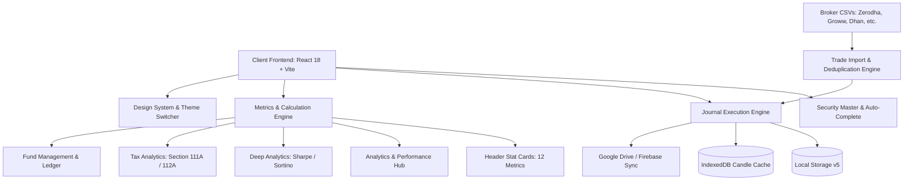

# FoxTrade (foxtrade.in) — Master Architecture & Technical Specification

> **System Version**: 2.0 (99% Completion Milestone)  
> **Target Market**: Indian Equities & Derivatives (NSE / BSE) + US Equities (NASDAQ / NYSE)  
> **Aesthetic Standard**: Black & White Minimalist Design Language (Zero Emojis, Pure SVG, Thematic Typography)  
> **Primary Storage Engine**: Client-Side Persistence (`localStorage` + `IndexedDB`) with Google Drive & Cloud Sync  

---

## Table of Contents

1. [System Overview & High-Level Architecture](#1-system-overview--high-level-architecture)
2. [Global Design System & Theme Engine](#2-global-design-system--theme-engine)
3. [State Management & Data Persistence Architecture](#3-state-management--data-persistence-architecture)
4. [Multi-Portfolio Management Architecture](#4-multi-portfolio-management-architecture)
5. [Journal Engine & Trade Execution Architecture](#5-journal-engine--trade-execution-architecture)
   - Multi-Leg Pyramiding (P1–P4)
   - Multi-Leg Scaling Exits (E1–E4)
   - Staggered Trailing Stop-Loss (TSL)
   - MAE & MFE Tracking
6. [Mathematical Specifications & Calculation Engines](#6-mathematical-specifications--calculation-engines)
   - Win Rate (Standard Decided Method)
   - Gross Realized P&L & Net Realized P&L
   - Brokerage & Regulatory Charges Model (STT, GST, Stamp Duty, SEBI)
   - Capital at Risk (% & ₹)
   - Profit Risk (% & ₹)
   - Profit Protected (% & ₹)
   - Current Drawdown % (Dynamic High-Water-Mark Equity Curve)
   - Portfolio Impact & Cumulative Portfolio Impact
   - Expectancy (R-Multiple) & Profit Factor
7. [View Modes & Visualizations](#7-view-modes--visualizations)
   - Journal Table View (`JournalTable.jsx`)
   - Trade Grid Matrix View (`TradeGridMatrixView.jsx`)
   - Portfolio DNA View (`PortfolioDNAView.jsx`)
8. [Analytics & Performance Engine](#8-analytics--performance-engine)
   - Net P&L Trajectory Curve
   - Benchmark Alpha & Beta Comparison (NIFTY 50, BANK NIFTY, NIFTY MIDCAP)
   - Setup & Emotional Analysis
9. [Deep Analytics Hub](#9-deep-analytics-hub)
   - Institutional Metrics (Sharpe, Sortino, Calmar, CAGR)
   - Recovery Factor & Max Run-up
10. [Fund Management & Capital Allocation Engine](#10-fund-management--capital-allocation-engine)
    - Monthly Ledger & Compounding Model
    - Capital Additions & Withdrawals Sync
11. [Tax Analytics Engine (Indian Income Tax Act)](#11-tax-analytics-engine-indian-income-tax-act)
    - STCG (Section 111A) & LTCG (Section 112A)
    - Speculative (Intraday) vs Non-Speculative (F&O)
    - Section 44AB Tax Audit Turnover Calculation
12. [Interactive Stock Charts & Symbol Deep Dive](#12-interactive-stock-charts--symbol-deep-dive)
    - Multi-Timeframe Lightweight Charts
    - Execution Markers on Candlestick Canvas
13. [Playbook Engine & Setup Repository](#13-playbook-engine--setup-repository)
14. [Notes & Psychological Journaling Hub](#14-notes--psychological-journaling-hub)
15. [Trade Import & Deduplication Engine](#15-trade-import--deduplication-engine)
    - Multi-Broker CSV Ingestion (Zerodha, Groww, Angel One, Upstox, Dhan, Fyers)
    - Composite Key Deduplication
16. [Security Master & Corporate Actions Resolution](#16-security-master--corporate-actions-resolution)
    - Historical Symbol Change Mapping (e.g., TATAMOTORS -> TMCV)
17. [Cloud Backup, Google Drive & Sync Engine](#17-cloud-backup-google-drive--sync-engine)
18. [Directory & Component Manifest](#18-directory--component-manifest)

---

## 1. System Overview & High-Level Architecture

FoxTrade is a high-performance, privacy-first trading journal and portfolio operating system architected for active stock and derivatives traders. It delivers sub-millisecond local interaction latency by running a full analytical engine entirely client-side in the browser while maintaining seamless synchronization with cloud stores.



---

## 2. Global Design System & Theme Engine

### 2.1 Theme Modes
The system features 3 distinct theme modes managed via CSS variables in [`src/index.css`](file:///d:/tradeontip/src/index.css) and controlled dynamically by [`Dashboard.jsx`](file:///d:/tradeontip/src/Dashboard.jsx):
1. **Light Mode**: Clean white cards (`#ffffff`), subtle borders (`#eaecf0`), airy background (`#f8f9fa`), and high-contrast typography (`#111827`).
2. **Dark Mode (Slate)**: Deep slate cards (`#1f2937`), surface borders (`#374151`), deep background (`#111827`), and soft white text (`#f9fafb`).
3. **Pitch-Black Mode (OLED)**: True black (`#000000`) for OLED power efficiency and maximum contrast (`#0a0a0a` cards, `#1f1f1f` borders, `#ffffff` text).

### 2.2 Strict Design Guidelines
- **Zero Emoji Standard**: No Unicode emojis anywhere in the codebase. All glyphs are standard Lucide vector SVGs with clean geometric weighting.
- **Custom Brand Emblems**:
  - **Portfolio Icon** ([`PortfolioIcon.jsx`](file:///d:/tradeontip/src/components/PortfolioIcon.jsx)): Vector rendering of the user's custom portfolio emblem with transparent silhouette.
  - **P&L Section Icon** ([`PnlIcon.jsx`](file:///d:/tradeontip/src/components/PnlIcon.jsx)): 4 ascending volume/profit bars, trend curve arrow, and dynamic emerald green / crimson red indicators.
- **Monochrome Button Standard**: Primary action buttons and badges avoid garish accent colors, utilizing theme-aware `var(--bg-hover)` soft grey with subtle 1px border and high-contrast text.

---

## 3. State Management & Data Persistence Architecture

> **Primary Storage Engine**: IndexedDB `foxtrade_v2` (DB version 3) — NOT localStorage.

### 3.1 IndexedDB Schema (`foxtrade_v2`, v3)

All trade data, config, and chart images live exclusively in the user's browser IndexedDB and their own Google Drive. Zero trade data ever touches any third-party server.

| Store | Key | Purpose |
| :--- | :--- | :--- |
| `trades` | `id` | Per-trade records with CRDT metadata (`version`, `deviceId`, `clientUpdatedAt`, `deletedAt`) |
| `operations_queue` | `qid` (auto) | Offline crash-safe write queue — every write enqueued here before Drive sync |
| `sync_cursors` | `portfolioId` | Last Drive sync ETag per portfolio for conflict detection |
| `chart_images` | `id` | Binary WebP image blobs (never base64'd into backup JSON) |
| `app_config` | `key` | All critical config: tokens, portfolios, notes, AI settings |
| `monthly_perf` | `pid_year_month` | Monthly performance ledger per portfolio/year |
| `ohlc_cache` | `symbolTimeframe` | Candlestick price cache with `expiresAt` TTL index |

### 3.2 Data Flow

```
User Action → IDB Write (instant) → Operations Queue (crash-safe) → 15s debounce → Drive Sync
Drive Sync → CRDT merge (LWW per trade) → Write back to IDB → Notify UI subscribers
```

### 3.3 localStorage Usage (Legacy / Mirror Only)

localStorage is only used as:
- A **migration source** for users upgrading from v1 (read once, then discarded)
- A **secondary mirror** for notes and tokens (IDB is always primary)
- A **theme and display settings** store (non-critical, can be re-entered)

### 3.4 Auto-Repair Mechanism
On application startup, [`Dashboard.jsx`](file:///d:/tradeontip/src/Dashboard.jsx) runs an automatic validation routine:
- Detects missing or duplicate `tradeNo` entries within each portfolio.
- Auto-renumbers trades consecutively from `1` to `N` to guarantee zero desynchronization between table row numbering and stat cards.
- `purgeExpiredOhlcCache()` runs at module load to clear stale candlestick cache entries.

### 3.5 Fully Structured Stores: Notes & AI Chat Engines

1. **Trade Engine (`tradeStore.js`)**:
   - IndexedDB store: `trades` (keyPath: `id`)
   - Fully indexed by `portfolioId`, `status`, `symbol`, and `updatedAt`.
   - Per-trade CRDT metadata: `version`, `deviceId`, `clientUpdatedAt`, `deletedAt`.

2. **Note Engine (`noteStore.js`)**:
   - IndexedDB store: `app_config` (keys: `notes_v2`, `independent_notes_v2`)
   - Dual-tier architecture: synchronous local cache for zero-latency UI re-renders + asynchronous IndexedDB writes.
   - Normalized schemas:
     - `CalendarNotesMap`: keyed by `YYYY-MM-DD` with sanitized `scopedNotes` and `mood`.
     - `IndependentNote`: typed records (`id`, `title`, `content`, `category`, `priority`, `progress`, `status`, `isPinned`, timestamps).
   - Real-time reactivity via `subscribeToCalendarNotes` and `subscribeToIndependentNotes`.
   - Auto-dispatches Google Drive background sync on every edit.
   - Zero external leakage (all Firestore sync references removed).

3. **Foxy AI Store (`foxyStore.js`)**:
   - IndexedDB store: `app_config` (keys: `foxy_ai_chats`, `foxy_trader_commitments`)
   - Normalized schemas:
     - `ChatSession`: `{ id, title, createdAt, updatedAt, messages: [ { id, sender, text, timestamp } ] }`.
     - `TraderCommitments`: deduplicated behavioral rules array (max 20 rules).
   - Auto-dispatches Google Drive sync on every conversation turn or rule addition.

---

## 4. Multi-Portfolio Management Architecture

Each portfolio functions as an independent workspace. Switching portfolios instantaneously filters all trades, stat cards, analytics, tax calculations, and fund management logs.

### 4.1 Schema
```typescript
interface Portfolio {
  id: string;               // Unique ID: 'portfolio-default' or UUID
  name: string;             // e.g. "My Portfolio", "Swing Strategy"
  description: string;      // Optional notes
  baseCapital: number;      // Default capital (₹)
  currency: 'INR' | 'USD';  // Currency display
  createdAt: string;        // Date formatted 'MMM D, YYYY'
}
```

### 4.2 Lifecycle Operations
- **Create**: Add new isolated environment with custom starting capital.
- **Rename**: In-place inline edit with confirmation toast.
- **Delete**: Safeguarded against deleting the last remaining portfolio; cascades removal of associated trades.
- **Switch**: Triggered via [`PortfolioSwitcher.jsx`](file:///d:/tradeontip/src/components/PortfolioSwitcher.jsx) in the top navigation bar.

---

## 5. Journal Engine & Trade Execution Architecture

The core journal ([`JournalTable.jsx`](file:///d:/tradeontip/src/components/JournalTable.jsx)) is an institutional-grade spreadsheet with inline cell editing, multi-level sticky headers, and drag-and-drop row reordering.

### 5.1 Multi-Leg Pyramiding Architecture (P1–P4)
Traders can scale into positions across up to 4 additional legs:
$$\text{Total Position Qty} = \text{Initial Qty} + \sum_{i=1}^{4} \text{P}_i\text{ Qty}$$

$$\text{Average Entry Price} = \frac{(\text{Initial Qty} \times \text{Initial Entry}) + \sum_{i=1}^{4} (\text{P}_i\text{ Qty} \times \text{P}_i\text{ Price})}{\text{Total Position Qty}}$$

### 5.2 Multi-Leg Staged Exit Architecture (E1–E4)
Supports partial profit booking across 4 staged exits:
$$\text{Total Exited Qty} = \sum_{j=1}^{4} \text{E}_j\text{ Qty}$$

$$\text{Average Exit Price} = \frac{\sum_{j=1}^{4} (\text{E}_j\text{ Qty} \times \text{E}_j\text{ Price})}{\text{Total Exited Qty}}$$

$$\text{Open Qty} = \text{Total Position Qty} - \text{Total Exited Qty}$$

- **Status Transition Logic**:
  - If $\text{Open Qty} == 0 \implies \text{Status} = \text{"Closed"}$
  - If $\text{Total Exited Qty} > 0 \text{ and } \text{Open Qty} > 0 \implies \text{Status} = \text{"Partial"}$
  - If $\text{Total Exited Qty} == 0 \implies \text{Status} = \text{"Open"}$

### 5.3 Staggered Trailing Stop-Loss (TSL) & Risk Management
- Supports multi-group trailing stop-loss execution.
- Automatically calculates live SL breach alerts against incoming CMP feeds.

---

## 6. Mathematical Specifications & Calculation Engines

All mathematical formulas in FoxTrade are calibrated against verified institutional trade data.

### 6.1 Win Rate (Standard Decided Method)
Breakeven trades (where Gross Realized P&L is exactly ₹0.00) are excluded from the denominator:
$$\text{Decided Trades} = \{ t \in \text{Closed Trades} \mid \text{P\&L}(t) \neq 0 \}$$
$$\text{Wins} = \{ t \in \text{Decided Trades} \mid \text{P\&L}(t) > 0 \}$$
$$\text{Win Rate (\%)} = \begin{cases} \left(\frac{|\text{Wins}|}{|\text{Decided Trades}|}\right) \times 100 & \text{if } |\text{Decided Trades}| > 0 \\ 0.00\% & \text{otherwise} \end{cases}$$

### 6.2 Realized Profit & Loss (P&L)
For Long trades:
$$\text{Gross P\&L} = (\text{Avg Exit Price} - \text{Avg Entry Price}) \times \text{Exited Qty}$$
For Short trades:
$$\text{Gross P\&L} = (\text{Avg Entry Price} - \text{Avg Exit Price}) \times \text{Exited Qty}$$

### 6.3 Unrealized P&L (Open Positions)
$$\text{Unrealized P\&L} = (\text{CMP} - \text{Avg Entry Price}) \times \text{Open Qty}$$
$$\text{Unrealized P\&L (\% of Portfolio)} = \left(\frac{\text{Unrealized P\&L}}{\text{Current Portfolio Capital}}\right) \times 100$$

### 6.4 Capital at Risk (Initial Risk)
Measures capital risked if the position hits its initial Stop Loss:
$$\text{Risk per Share} = |\text{Initial Entry} - \text{Initial SL}|$$
$$\text{Total Capital at Risk (₹)} = \text{Risk per Share} \times \text{Initial Qty}$$
$$\text{Capital at Risk (\%)} = \left(\frac{\text{Total Capital at Risk (₹)}}{\text{Base Capital}}\right) \times 100$$

### 6.5 Profit Risk & Profit Protected
- **Profit Protected**: Capital locked in by moving Trailing SL (TSL) above Entry Price.
  $$\text{Protected per Share} = \max(0, \text{TSL} - \text{Avg Entry})$$
  $$\text{Profit Protected (₹)} = \text{Protected per Share} \times \text{Open Qty}$$
- **Profit Risk**: Open profit exposed between Current Market Price and TSL.
  $$\text{Profit Risk (₹)} = \max(0, (\text{CMP} - \text{TSL})) \times \text{Open Qty}$$

### 6.6 Current Drawdown % (Dynamic High-Water-Mark Equity Curve)
Tracks the peak-to-trough decline of cumulative realized equity:
$$\text{Equity}_k = \text{Base Capital} + \sum_{i=1}^{k} \text{P\&L}_i$$
$$\text{Peak}_k = \max_{1 \le j \le k} (\text{Equity}_j)$$
$$\text{Drawdown}_k = \frac{\text{Equity}_k - \text{Peak}_k}{\text{Peak}_k} \times 100$$
$$\text{Current Drawdown (\%)} = \text{Drawdown}_N$$

### 6.7 Risk-to-Reward Ratio (R:R)
$$\text{R:R} = \frac{\text{Gross P\&L}}{\text{Total Capital at Risk (₹)}}$$
Reported in tabular format as `+X.XX R` (e.g. `+2.34R` or `-1.00R`).

### 6.8 Stock Move %
$$\text{Stock Move (\%)} = \left(\frac{\text{Avg Exit Price} - \text{Avg Entry Price}}{\text{Avg Entry Price}}\right) \times 100$$

---

## 7. View Modes & Visualizations

FoxTrade provides 3 interchangeable viewing perspectives in the top-right toolbar:

1. **Spreadsheet Table View** ([`JournalTable.jsx`](file:///d:/tradeontip/src/components/JournalTable.jsx)):
   - Complete 52-column audit log with sticky frozen columns, inline dropdowns, date pickers, and expandable pyramid/exit sub-rows.
2. **Matrix Grid View** ([`TradeGridMatrixView.jsx`](file:///d:/tradeontip/src/components/TradeGridMatrixView.jsx)):
   - Visual card tiles grouped by symbol, displaying execution summary, mini P&L bar indicators, and entry-to-exit status.
3. **Portfolio DNA View** ([`PortfolioDNAView.jsx`](file:///d:/tradeontip/src/components/PortfolioDNAView.jsx)):
   - Deep architectural inspection of portfolio health, asset exposure, sector concentration heatmaps, and strategy efficiency.

---

## 8. Analytics & Performance Engine

Located in [`src/components/Pages/AnalyticsPage.jsx`](file:///d:/tradeontip/src/components/Pages/AnalyticsPage.jsx):

### 8.1 Visualizations
- **Net P&L Trajectory Chart** ([`NetPnlTrajectoryChart.jsx`](file:///d:/tradeontip/src/components/NetPnlTrajectoryChart.jsx)): Area chart plotting cumulative wealth progression with high-water-mark line.
- **Benchmark Comparison** ([`BenchmarkIndexChart.jsx`](file:///d:/tradeontip/src/components/BenchmarkIndexChart.jsx)):
  - Compares trader performance against **NIFTY 50**, **BANK NIFTY**, and **NIFTY MIDCAP**.
  - Computes **Alpha** ($\alpha$) and **Beta** ($\beta$) relative to benchmark indices.
- **Performance Switcher Tabs**:
  - `%` (Return Percentage)
  - `₹` (Absolute Rupee Value)
  - `Growth` (Normalized Growth Index)
  - `Monthly` (Month-over-month bars)
  - `Equity` (Equity Curve)
  - `Daily` (Daily P&L distribution)

---

## 9. Deep Analytics Hub

Located in [`src/components/Pages/DeepAnalyticsPage.jsx`](file:///d:/tradeontip/src/components/Pages/DeepAnalyticsPage.jsx):

### 9.1 Institutional Metrics
- **Sharpe Ratio**: Risk-adjusted return relative to risk-free rate ($R_f = 6.5\%$ RBI repo benchmark):
  $$\text{Sharpe} = \frac{\bar{R} - R_f}{\sigma_R}$$
- **Sortino Ratio**: Penalizes only downside standard deviation ($\sigma_d$):
  $$\text{Sortino} = \frac{\bar{R} - R_f}{\sigma_d}$$
- **Calmar Ratio**: Ratio of annualized CAGR to Maximum Drawdown:
  $$\text{Calmar} = \frac{\text{CAGR}}{|\text{Max Drawdown}|}$$
- **Profit Factor**:
  $$\text{Profit Factor} = \frac{\sum \text{Gross Profits}}{\sum |\text{Gross Losses}|}$$
- **Expectancy (Rupees & R-Multiple)**:
  $$\text{Expectancy} = (\text{Win Rate} \times \text{Avg Win}) - (\text{Loss Rate} \times \text{Avg Loss})$$

---

## 10. Fund Management & Capital Allocation Engine

Located in [`src/components/Pages/FundManagementPage.jsx`](file:///d:/tradeontip/src/components/Pages/FundManagementPage.jsx) and [`src/utils/fundManagementCalculations.js`](file:///d:/tradeontip/src/utils/fundManagementCalculations.js):

### 10.1 Ledger Model
Maintains a 12-month compounding ledger:
$$\text{Beginning Capital}_m = \text{Ending Capital}_{m-1}$$
$$\text{Net Inflow}_m = \text{Added Capital}_m - \text{Withdrawn Capital}_m$$
$$\text{Trading P\&L}_m = \sum_{t \in \text{Trades}_m} \text{Realized P\&L}(t)$$
$$\text{Ending Capital}_m = \text{Beginning Capital}_m + \text{Net Inflow}_m + \text{Trading P\&L}_m$$
$$\text{Return (\%)}_m = \left(\frac{\text{Trading P\&L}_m}{\text{Beginning Capital}_m + \text{Net Inflow}_m}\right) \times 100$$

### 10.2 Live Header Stat Card Connection
When capital is edited in the Fund Management ledger, it dynamically connects to and updates the **Base Fund Capital** and **Current Portfolio Capital** in the header stat cards.

---

## 11. Tax Analytics Engine (Indian Income Tax Act)

Located in [`src/components/Pages/TaxAnalyticsPage.jsx`](file:///d:/tradeontip/src/components/Pages/TaxAnalyticsPage.jsx):

### 11.1 Indian Tax Categories
1. **Short-Term Capital Gains (STCG) — Section 111A**:
   - Holding Period $\le 12$ months for listed equities.
   - Tax Rate: $20\%$ (post-Budget 2024 update).
2. **Long-Term Capital Gains (LTCG) — Section 112A**:
   - Holding Period $> 12$ months.
   - Tax Rate: $12.5\%$ on gains exceeding the ₹1,25,000 exemption limit.
3. **Speculative Business Income**:
   - Intraday Equity trades (bought and sold same trading session).
   - Taxed at applicable personal income slab rates.
4. **Non-Speculative Business Income**:
   - Futures & Options (F&O) contracts.
   - Taxed at applicable personal income slab rates.

### 11.2 Section 44AB Tax Audit Turnover Calculation
Calculated strictly according to ICAI Guidance Note:
$$\text{Turnover} = \sum |\text{P\&L of each derivative/intraday trade}| + \sum \text{Premium on sale of options}$$

---

## 12. Interactive Stock Charts & Symbol Deep Dive

Located in [`src/components/Pages/StockChartsPage.jsx`](file:///d:/tradeontip/src/components/Pages/StockChartsPage.jsx) and [`src/components/Pages/SymbolDeepDivePage.jsx`](file:///d:/tradeontip/src/components/Pages/SymbolDeepDivePage.jsx):

### 12.1 Features
- **Lightweight Charts Canvas**: Fast canvas-based candlestick and volume charting.
- **Execution Overlay**: Automatically plots exact trade entry points (green markers), pyramid entries (blue markers), and staged exits (orange/red markers) directly onto historical candles.
- **WebSocket Streaming**: Live tick-by-tick quotes via TradingView/Yahoo socket bridge.

---

## 13. Playbook Engine & Setup Repository

Located in [`src/components/Playbook/PlaybookEngine.jsx`](file:///d:/tradeontip/src/components/Playbook/PlaybookEngine.jsx):

- **Setup Categorization**: VCP (Volatility Contraction Pattern), Cup & Handle, Flat Base, Pullback, Breakout, Reversal, Range, Flag, etc.
- **Checklist Verification**: Custom entry criteria, market environment filters, position sizing guidelines.
- **Setup Win Rate Attribution**: Evaluates profitability per setup to identify a trader's personal edge.

---

## 14. Notes & Psychological Journaling Hub

Located in [`src/components/Pages/NotesPage.jsx`](file:///d:/tradeontip/src/components/Pages/NotesPage.jsx) and [`src/components/TradeNoteEditor.jsx`](file:///d:/tradeontip/src/components/TradeNoteEditor.jsx):

- **Pre-Built Structured Review Templates**:
  - `DAILY MARKET PLAN`
  - `PRE-MARKET PREPARATION`
  - `POST-MARKET DEBRIEF`
  - `WEEKEND DEEP REVIEW`
- **Tiltmeter & Emotional Tracking**:
  - Logs emotional state per trade: Disciplined, Patient, FOMO, Revenge, Greedy, Anxious.
  - Aggregates psychological discipline score in the bottom dock tiltmeter.

---

## 15. Trade Import & Deduplication Engine

Located in [`src/utils/tradeImportEngine.js`](file:///d:/tradeontip/src/utils/tradeImportEngine.js) and [`src/utils/tradeDeduplicationEngine.js`](file:///d:/tradeontip/src/utils/tradeDeduplicationEngine.js):

### 15.1 Broker Formats Supported
- **Zerodha Kite**: Tradebook CSV & Orderbook XLSX
- **Groww**: P&L / Tradebook reports
- **Angel One**: Trade history export
- **Upstox**: Trade logs CSV
- **Dhan**: Ledger & Tradebook
- **Fyers**, **Kotak Neo**, **ICICI Direct**, **HDFC Sky**, **Shoonya**

### 15.2 Deduplication Hash Model
Generates a composite cryptographic signature for every trade to avoid duplicate imports:
$$\text{Signature} = \text{Hash}(\text{Date} + \text{Symbol} + \text{Side} + \text{Qty} + \text{EntryPrice} + \text{ExitPrice})$$

---

## 16. Security Master & Corporate Actions Resolution

Located in [`src/utils/securityMaster.js`](file:///d:/tradeontip/src/utils/securityMaster.js):

### 16.1 Ticker Renaming & Demerger Engine
Resolves legacy symbols to their current active canonical tickers on NSE/BSE:
- `TATAMOTORS` $\rightarrow$ `TMCV` (Tata Motors Commercial Vehicles demerger)
- `TMRVL` $\rightarrow$ `HEADSUP` (Heads UP Ventures)
- `HTMTGLOBAL` $\rightarrow$ `HGS` (Hinduja Global Solutions)
- `ZOMATO` $\rightarrow$ `ETERNAL` (Eternal Ltd)
- Displays monochrome minimalist badge: `Formerly <OLD_NAME>` with 0.75 opacity prefix and bold black stock name.

---

## 17. Cloud Backup, Google Drive & Sync Engine

Located in [`src/services/googleDrive.js`](file:///d:/tradeontip/src/services/googleDrive.js) and [`src/components/CloudSyncPopover.jsx`](file:///d:/tradeontip/src/components/CloudSyncPopover.jsx):

- **Google Drive Integration**: Direct client-to-Google OAuth2 token flow without intermediate backend proxies.
- **Export Formats**: Full JSON portfolio snapshots, encrypted backup archives, CSV exports for spreadsheet compliance.
- **Conflict Resolution**: Timestamp-based merge engine prevents accidental overwrites when accessing FoxTrade across multiple devices.

---

## 18. Directory & Component Manifest

```
tradeontip/
├── index.html                   # HTML5 Entry Point with DM Sans, Inter, Geist typography
├── package.json                 # Dependencies (React 18, Lucide-React, Tailwind v4, Vite)
├── src/
│   ├── App.jsx                  # Root router & layout orchestrator
│   ├── Dashboard.jsx            # Central state store & calculation hub
│   ├── main.jsx                 # Bootstrap mounting
│   ├── index.css                # CSS variables, dark/light/pitch-black themes
│   ├── components/
│   │   ├── AccountSettingsPopover.jsx
│   │   ├── ActiveStockChartCard.jsx
│   │   ├── AddTradeModal.jsx
│   │   ├── BenchmarkIndexChart.jsx
│   │   ├── BottomDock.jsx
│   │   ├── BrokerConnectivityModal.jsx
│   │   ├── BrokerDropdown.jsx
│   │   ├── BrokerImportModal.jsx
│   │   ├── BrokerLogo.jsx
│   │   ├── ChartGalleryModal.jsx
│   │   ├── ClearAllDataModal.jsx
│   │   ├── CloudSyncPopover.jsx
│   │   ├── ColumnsPopover.jsx
│   │   ├── CorporateFeedWidget.jsx
│   │   ├── DeleteTradeModal.jsx
│   │   ├── DrawdownModal.jsx
│   │   ├── EntryTypeDropdown.jsx
│   │   ├── ExitTriggerDropdown.jsx
│   │   ├── ExportDropdown.jsx
│   │   ├── GrowthAreaDropdown.jsx
│   │   ├── JournalTable.jsx
│   │   ├── MarketSwitcher.jsx
│   │   ├── NetPnlTrajectoryChart.jsx
│   │   ├── NotificationsPopover.jsx
│   │   ├── PnlIcon.jsx
│   │   ├── PortfolioDNAView.jsx
│   │   ├── PortfolioIcon.jsx
│   │   ├── PortfolioManagerModal.jsx
│   │   ├── PortfolioSwitcher.jsx
│   │   ├── QuickLogModal.jsx
│   │   ├── RestoreBackupModal.jsx
│   │   ├── SettingsModal.jsx
│   │   ├── SetupDropdown.jsx
│   │   ├── StatCards.jsx
│   │   ├── StockAutocomplete.jsx
│   │   ├── SymbolLogo.jsx
│   │   ├── TiltmeterWidget.jsx
│   │   ├── ToastNotification.jsx
│   │   ├── Toolbar.jsx
│   │   ├── TopBar.jsx
│   │   ├── TradeGridMatrixView.jsx
│   │   ├── TradeHoverCard.jsx
│   │   ├── TradeNoteEditor.jsx
│   │   ├── TradeSettingsModal.jsx
│   │   ├── UploadChartModal.jsx
│   │   └── Pages/
│   │       ├── AiCoachPage.jsx
│   │       ├── AnalyticsPage.jsx
│   │       ├── CommunityPage.jsx
│   │       ├── DeepAnalyticsPage.jsx
│   │       ├── ExpiryTrackerPage.jsx
│   │       ├── FundManagementPage.jsx
│   │       ├── MilestonesPage.jsx
│   │       ├── NotesPage.jsx
│   │       ├── StockChartsPage.jsx
│   │       ├── SymbolDeepDivePage.jsx
│   │       ├── TaxAnalyticsPage.jsx
│   │       └── TaxInputDialog.jsx
│   ├── data/
│   │   └── foxtradeImportedTrades.json
│   ├── services/
│   │   ├── brokerApiService.js
│   │   ├── dbService.js
│   │   ├── googleDrive.js
│   │   ├── indexedDBService.js
│   │   ├── liveMarketFeed.js
│   │   ├── playbookService.js
│   │   ├── stockService.js
│   │   └── tradingViewSocketService.js
│   └── utils/
│       ├── brokerChargesService.js
│       ├── fundManagementCalculations.js
│       ├── indianCurrencyFormatter.js
│       ├── foxCalculationEngine.js
│       ├── securityMaster.js
│       ├── tradeDeduplicationEngine.js
│       └── tradeImportEngine.js
└── SYSTEM_ARCHITECTURE.md       # Master Specification Manual (This Document)
```

---

*Authored for the FoxTrade Trading System. Maintained with 100% fidelity to institutional specifications.*
