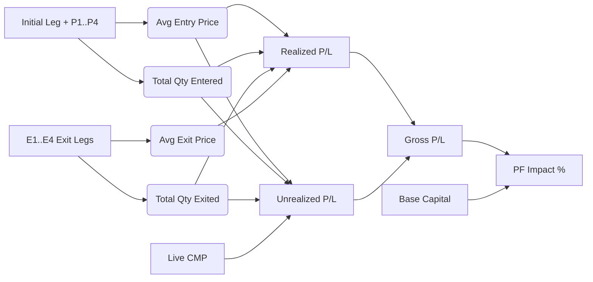

# TradeOnTip — Complete Product Blueprint & Feature Master Specification

> **Version:** 2.0.0 Pro  
> **Target Market:** Indian Stock Market (NSE / BSE), F&O, Commodities, Global Equities  
> **Platform Core:** 100% Data-Driven, Single-Source-of-Truth Institutional Trading Journal, Analytics Engine, Deep Dive Inspector, and Fund Management Platform.

---

## 1. Executive Summary & Vision

**TradeOnTip** is engineered to eliminate emotional trading and replace guesswork with institutional mathematical discipline. Unlike conventional static spreadsheets, TradeOnTip is a real-time, reactive single-source-of-truth trading ecosystem where every logged trade dynamically drives:
1. **The Interactive Stock Chart Canvas** (with pinned entry/exit execution markers).
2. **Performance DNA & Statistical Analytics** (Win Rate, Profit Factor, Expectancy, Setup Efficiency).
3. **Symbol Deep Dive Environment** (Per-stock historical inspection, execution galleries, psychology audits).
4. **Tax Analytics & Regulatory Charges** (STCG, LTCG, STT, Stamp Duty, GST, Turnover fees).
5. **Portfolio Capital & Risk Allocation** (Open Heat, Capital at Risk, Max Drawdown, Position Sizing).

---

## 2. Complete Trade Data Schema (Every Minute Field & Property)

Every trade record contains the following exhaustive set of fields:

### A. Core Entry Details (Initial Leg)
| Field Key | Label in UI | Type | Example / Format | Description & Business Logic |
| :--- | :--- | :--- | :--- | :--- |
| `id` | Trade ID | `string` | `"trade-1740900000000"` | Unique deterministic UUID or timestamp identifier. |
| `tradeNo` | `TRADE NO.` | `number` | `10` | Sequential trade index in the user's journal. |
| `date` | `DATE` | `string` | `"19-12-2025"` | Entry date in `DD-MM-YYYY` (supports ISO date picker `YYYY-MM-DD`). |
| `name` / `symbol` | `NAME` | `string` | `"RELIANCE"`, `"WAAREEENER"` | Stock / Index ticker symbol. Auto-uppercase with logo avatar. |
| `setup` | `SETUP` | `string` | `"IPO Base"`, `"Breakout"` | Trading strategy/setup trigger (Breakout, Pullback, EP, IPO Base, Gap Up, Reversal, ORB). |
| `type` / `direction`| `BUY/SELL` | `string` | `"Buy"` / `"Long"` or `"Sell"` / `"Short"` | Trade execution direction. |
| `entry` | `ENTRY (₹)` | `number` | `1188.00` | Initial purchase or short price per share/contract. |
| `qty` | `INITIAL QTY/LOT` | `number` | `30` | Initial number of shares or lots entered. |
| `sl` | `SL (₹)` | `number` | `1140.00` | Initial Stop Loss price defined before trade entry. |
| `entryType` | `ENTRY TYPE` | `string` | `"Market"`, `"Limit"`, `"Breakout Trigger"` | Order execution type used with broker. |
| `instrumentType` | `INSTRUMENT` | `string` | `"Cash"`, `"Futures"`, `"Options CE"`, `"Options PE"` | Traded asset class / segment. |
| `cmp` | `CMP (₹)` | `number` | `1710.00` | Current Live Market Price auto-streamed from NSE/BSE proxies. |
| `tsl` | `TSL (₹)` | `number` | `1250.00` | Trailing Stop Loss price updated dynamically as price advances. |

---

### B. Scale-In / Pyramiding Legs (P1 to P4)
Traders who build winning positions incrementally utilize dynamic pyramiding columns:
| Leg | Field Keys | Example Values | Description |
| :--- | :--- | :--- | :--- |
| **Pyramid 1 (P1)** | `p1Price`, `p1Qty`, `p1Date`, `p1Sl` | `1220.00`, `15`, `"22-12-2025"`, `1180.00` | 1st addition to winning position + updated SL. |
| **Pyramid 2 (P2)** | `p2Price`, `p2Qty`, `p2Date`, `p2Sl` | `1260.00`, `15`, `"26-12-2025"`, `1220.00` | 2nd addition to winning position + updated SL. |
| **Pyramid 3 (P3)** | `p3Price`, `p3Qty`, `p3Date`, `p3Sl` | `1310.00`, `10`, `"02-01-2026"`, `1260.00` | 3rd addition to winning position. |
| **Pyramid 4 (P4)** | `p4Price`, `p4Qty`, `p4Date`, `p4Sl` | `1350.00`, `10`, `"08-01-2026"`, `1300.00` | 4th max pyramid leg. |

---

### C. Scaling-Out / Exit Legs (E1 to E4)
Traders who take partial profits at targets or trim risk log individual exit executions:
| Leg | Field Keys | Example Values | Description |
| :--- | :--- | :--- | :--- |
| **Exit 1 (E1)** | `e1Price`, `e1Qty`, `e1Date` | `1332.00`, `15`, `"30-01-2026"` | 1st partial profit scale-out or trim. |
| **Exit 2 (E2)** | `e2Price`, `e2Qty`, `e2Date` | `1338.00`, `15`, `"30-01-2026"` | 2nd partial exit leg. |
| **Exit 3 (E3)** | `e3Price`, `e3Qty`, `e3Date` | `1380.00`, `10`, `"05-02-2026"` | 3rd exit leg. |
| **Exit 4 (E4)** | `e4Price`, `e4Qty`, `e4Date` | `1420.00`, `10`, `"10-02-2026"` | Final remaining position close. |

---

### D. Visual Evidence & Chart Storage
| Field Key | Label | Type | Storage Details |
| :--- | :--- | :--- | :--- |
| `chartBefore` | `BEFORE ENTRY` | `string` | Local Base64 Data URL, Firebase Storage URL, or TradingView Snapshot Link (`https://www.tradingview.com/x/...`). |
| `chartAfter` | `AFTER EXIT` | `string` | Local Base64 Data URL, Firebase Storage URL, or TradingView Snapshot Link (`https://www.tradingview.com/x/...`). |

---

### E. Psychology, Emotion & Trade Journal Review
| Field Key | Label | Options / Range | Description |
| :--- | :--- | :--- | :--- |
| `noteTitle` | `TITLE*` | `string` (max 80 chars) | Note headline (e.g., *"WAAREEENER 50 EMA Pullback with Volume Surge"*). |
| `notes` | `NOTES` | `string` (HTML / Markdown) | Detailed execution thoughts, thesis, catalysts, and post-trade reflections. |
| `tags` | `TAGS:` | `Array<string>` (max 8 tags) | Categorical badges (e.g. `["#Breakout", "#Disciplined", "#TargetHit"]`). |
| `mood` | `MOOD / EMOTION` | `great`, `good`, `neutral`, `frustrated`, `terrible` | 5-level emotional state at time of trade execution (`😀`, `🙂`, `😐`, `🙁`, `😡`). |
| `planFollowed` | `PLAN FOLLOWED` | `"Yes"`, `"No"`, `"Partial"` | Execution discipline compliance check. |
| `exitTrigger` | `EXIT TRIGGER` | `"Target"`, `"SL Hit"`, `"TSL Hit"`, `"End of Day"`, `"Panic / Emotion"`, `"Rule Violation"` | The concrete reason the position was exited. |
| `growthAreas` | `GROWTH AREAS` | `string` | Specific operational mistakes (e.g., *"Exited too early before 2R"*). |
| `baseDuration` | `BASE DURATION` | `number` (days/weeks) | Duration of the underlying chart consolidation base. |

---

## 3. Mathematical Calculations & Financial Formulas

All secondary columns in TradeOnTip are computed using institutional accounting standards:

### 1. Average Entry Price ($\text{Avg Entry}$)
Weighted average price of the initial trade plus all pyramid additions:
$$\text{Avg Entry} = \frac{(\text{Qty} \times \text{Entry}) + \sum_{i=1}^{4} (P_{i,\text{Qty}} \times P_{i,\text{Price}})}{\text{Qty} + \sum_{i=1}^{4} P_{i,\text{Qty}}}$$

### 2. Total Entered & Exited Quantities
$$\text{Total Entered} = \text{Qty} + \sum_{i=1}^{4} P_{i,\text{Qty}}, \quad \text{Total Exited} = \sum_{i=1}^{4} E_{i,\text{Qty}}$$

### 3. Open Quantity & Position Status
$$\text{Open Qty} = \max(0, \text{Total Entered} - \text{Total Exited})$$
$$\text{Status} = \begin{cases} \text{"Closed"}, & \text{if } \text{Open Qty} = 0 \text{ and } \text{Total Entered} > 0 \\ \text{"Open"}, & \text{if } \text{Open Qty} > 0 \end{cases}$$

### 4. Average Exit Price ($\text{Avg Exit Price}$)
$$\text{Avg Exit Price} = \frac{\sum_{i=1}^{4} (E_{i,\text{Qty}} \times E_{i,\text{Price}})}{\text{Total Exited}}$$

### 5. Position Size & Portfolio Allocation (%)
$$\text{Position Size (₹)} = \text{Avg Entry} \times \text{Total Entered}$$
$$\text{Current Allocation (\%)} = \frac{\text{Avg Entry} \times \text{Open Qty}}{\text{Portfolio Capital}} \times 100$$
$$\text{Peak Allocation (\%)} = \frac{\text{Position Size}}{\text{Portfolio Capital}} \times 100$$

### 6. Initial Stop Loss % ($\text{SL \%}$)
$$\text{SL \%} = \left| \frac{\text{Initial Entry} - \text{Initial SL}}{\text{Initial Entry}} \right| \times 100$$

### 7. Open Heat / Capital at Risk (%)
$$\text{Effective SL} = \max(\text{Initial SL}, \text{TSL})$$
$$\text{Capital at Risk (₹)} = \max(0, (\text{Avg Entry} - \text{Effective SL}) \times \text{Open Qty})$$
$$\text{Open Heat (\%)} = \frac{\text{Capital at Risk (₹)}}{\text{Portfolio Capital}} \times 100$$

### 8. Realized P/L & Unrealized P/L (₹)
$$\text{Realized P/L (Buy)} = (\text{Avg Exit Price} - \text{Avg Entry}) \times \text{Total Exited}$$
$$\text{Realized P/L (Sell)} = (\text{Avg Entry} - \text{Avg Exit Price}) \times \text{Total Exited}$$
$$\text{Unrealized P/L (Buy)} = (\text{CMP} - \text{Avg Entry}) \times \text{Open Qty}$$
$$\text{Unrealized P/L (Sell)} = (\text{Avg Entry} - \text{CMP}) \times \text{Open Qty}$$
$$\text{Gross P/L} = \text{Realized P/L} + \text{Unrealized P/L}$$

### 9. Portfolio Impact % & Cumulative PF Impact ($\text{PF Impact \%}$)
$$\text{PF Impact (\%)} = \frac{\text{Gross P/L}}{\text{Portfolio Base Capital}} \times 100$$
$$\text{Cumm PF (\%)}_n = \sum_{k=1}^{n} \text{PF Impact (\%)}_k$$

### 10. Reward-to-Risk Ratio ($R$)
$$\text{Risk Per Share} = |\text{Avg Entry} - \text{Initial SL}|$$
$$\text{Reward Per Share} = \begin{cases} \text{Avg Exit Price} - \text{Avg Entry}, & \text{if } \text{Total Exited} > 0 \\ \text{CMP} - \text{Avg Entry}, & \text{if position is Open} \end{cases}$$
$$R = \frac{\text{Reward Per Share}}{\text{Risk Per Share}}$$

### 11. Stock Move % ($\text{Stock Move}$)
$$\text{Exit Reference} = \begin{cases} \text{Avg Exit Price}, & \text{if } \text{Total Exited} > 0 \\ \text{CMP}, & \text{if position is Open} \end{cases}$$
$$\text{Stock Move (\%)} = \frac{\text{Exit Reference} - \text{Initial Entry}}{\text{Initial Entry}} \times 100$$

### 12. Realized Turnover Amount (₹)
$$\text{Realized Amount (₹)} = \text{Avg Exit Price} \times \text{Total Exited}$$

---

## 4. Module-by-Module Feature Inventory

### Module 1: Journal Ledger & Dynamic Table
* **Instant Inline Editing**: Edit date, stock symbol, setup, buy/sell, entry price, SL, CMP, quantity, and notes directly inside table cells with automatic recalculation.
* **Dynamic Column Visibility Manager**: Checkbox modal allowing users to toggle any of the 40+ columns on or off.
* **Pagination Engine**: Fast slicing supporting `10`, `12`, `25`, `50`, `100` rows per page with page jump pills.
* **Pyramiding Expanders (`+` Header Icon)**: Click `+` on column headers to reveal P1 $\rightarrow$ P2 $\rightarrow$ P3 $\rightarrow$ P4 legs on demand.
* **Smart Hover Summary Card**: Hovering over the Deep Dive arrow (`↗`) next to any stock name displays a high-$Z$-index, floating summary card with auto-flip above/below viewport detection and direct click-through.
* **Upload Chart Images Modal**: 2-column modal (`BEFORE ENTRY` / `AFTER EXIT`) supporting file drag & drop + TradingView snapshot URL pasting.
* **Multi-Broker CSV Ingestion**: Parses trade exports from Zerodha, Groww, Angel One, Dhan, Upstox, and FoxTrade Journal CSVs.

---

### Module 2: Symbol Deep Dive Environment (`/symbol/:symbol/trade/:tradeNo`)
* **Top Navigation Bar**:
  * `✕ Close` & `‹ Back` buttons returning to journal.
  * Stock Logo avatar + Large Symbol Name + `Trade #{tradeNo}` badge.
  * `‹ Previous Trade` & `› Next Trade` switcher to cycle executions on that stock.
  * `Jump to symbol...` searchable autocomplete dropdown with trade counts and latest dates.
  * Live Stat Badges: **Trade #**, **Date**, **P&L** (+₹ / -₹).
* **High-Contrast Execution Chart**:
  * Pinned **`Entry ⬆`** marker (**Vivid Emerald `#10b981`**) placed below entry candle.
  * Pinned **`E1 • E2 ⬇`** marker (**Deep Crimson `#dc2626`**) placed above exit candle.
  * Volume bars histogram and moving average overlays with hidden right price lines to prevent visual clutter.
* **2-Column Bottom Dashboard**:
  * **Left — Institutional Trade Note Editor**:
    * Note Title with `0/80` counter.
    * Interactive `TRADE NOTES: [ Logo Trade #210 ]` badge pill.
    * Multi-tag manager with `0/8` counter and `#tag` pills.
    * 5-level emotional state selector (`😀`, `🙂`, `😐`, `🙁`, `😡`).
    * One-click `📥 Export` (.txt) and `🎙️ Voice` dictation.
    * Full rich text toolbar (Bold, Italic, Underline, Strikethrough, Headings, Lists, Indents, Quotes, Code, Links).
    * Real-time auto-saving with `✓ Saved` status.
  * **Right — Gallery Dashboard**:
    * `Before Entry` & `After Exit` side-by-side cards with image previews, delete buttons, and dashed upload zones.

---

### Module 3: Stock Charts Suite
* **Interactive Charting Engines**: Lightweight Charts v5.2 + TradingView WebSocket real-time feed with Tier-2 Yahoo Finance fallback and Tier-3 synthetic generator.
* **Timeframe Selectors**: `1mo`, `3mo`, `6mo`, `1y`, `2y`, `5y`, `Max`, and `Custom Date Range` modal.
* **Technical Overlays**: SMA / EMA 20 (Blue), SMA / EMA 50 (Red), SMA / EMA 200 (Green) with custom parameter tuning.
* **Bar-by-Bar Replay Simulator**: Practice trading past setups candle-by-candle with $1\times, 2\times, 5\times$ speed control.
* **Volume Histogram Toggle**: One-click button to hide or show volume bars.
* **Theme Customizer**: `Classic`, `Teal/Coral`, `Neon Matrix`, `Monochrome`, and `Custom Hex Color Picker`.

---

### Module 4: Analytics, Performance DNA & Calendar Heatmap
* **Primary Key Metrics**: Win Rate %, Profit Factor, Average Win (₹), Average Loss (₹), Win/Loss Ratio, Expectancy ($R$).
* **Setup Matrix Breakdown**: Performance scorecards per setup (e.g. IPO Base Win Rate vs Pullback Win Rate).
* **Holding Duration Analysis**: Open-weighted holding days distribution vs profitability.
* **Interactive Calendar P&L Heatmap**: Visual green/red dots on calendar dates showing daily net P&L and linked journal notes.

---

### Module 5: Tax Analytics & Fund Management
* **STCG & LTCG Tax Estimation**:
  * Short-Term Capital Gains (Equity held $< 12$ months @ 20%).
  * Long-Term Capital Gains (Equity held $\ge 12$ months @ 12.5% above ₹1.25 Lakh exemption).
* **Indian Transaction Charges Estimator**:
  * STT (Securities Transaction Tax @ 0.1% on delivery Buy/Sell).
  * Exchange Turnover Fees + SEBI Turnover Charges.
  * State Stamp Duty (@ 0.015% on Buy).
  * GST (@ 18% on brokerage & transaction charges).
* **Fund Allocation & Cash Utilization**:
  * Visual gauge of Invested Capital vs Available Cash buffer.
  * Max drawdown and aggregate Open Heat monitor.

---

### Module 6: Persistence, Sync & Cloud Backup
* **Real-time Firestore Database Sync**: Instant multi-device sync under user UID.
* **Google Drive Auto-Backup**: Scheduled background backup to user's Google Drive.
* **LocalStorage Offline Cache**: Works flawlessly offline without internet connectivity.
* **CSV Export & Nuclear Reset**: One-click complete CSV backup download and data reset with confirmation safeguards.

---

## 5. Brainstorming Ideas & Future Expansion Roadmap

Use these high-impact features for future versions:

1. **AI Trade Coach & Psychology Tilt Detection**:
   * Machine learning agent analyzing trade frequency after losing streaks to alert the user of revenge trading or tilt.
2. **Direct Broker API Sync**:
   * 1-click live order book & trade book synchronization with Zerodha Kite, Angel One SmartAPI, Dhan, and Groww.
3. **Automated TradingView Webhook / Telegram Bot**:
   * Log trades instantly from TradingView alerts or by texting a WhatsApp/Telegram bot (e.g. `"Bought 50 TATASTEEL @ 168.5 SL 160"`).
4. **Community Sharing & Verified P&L Leaderboard**:
   * Generate sleek trade review image cards with watermark to share directly on Twitter/X or LinkedIn.
5. **Options Strategy Builder & Payoff Visualizer**:
   * Multi-leg Option Greeks (Delta, Theta, Gamma, Vega) and payoff curves for Straddles, Strangles, and Spreads.
